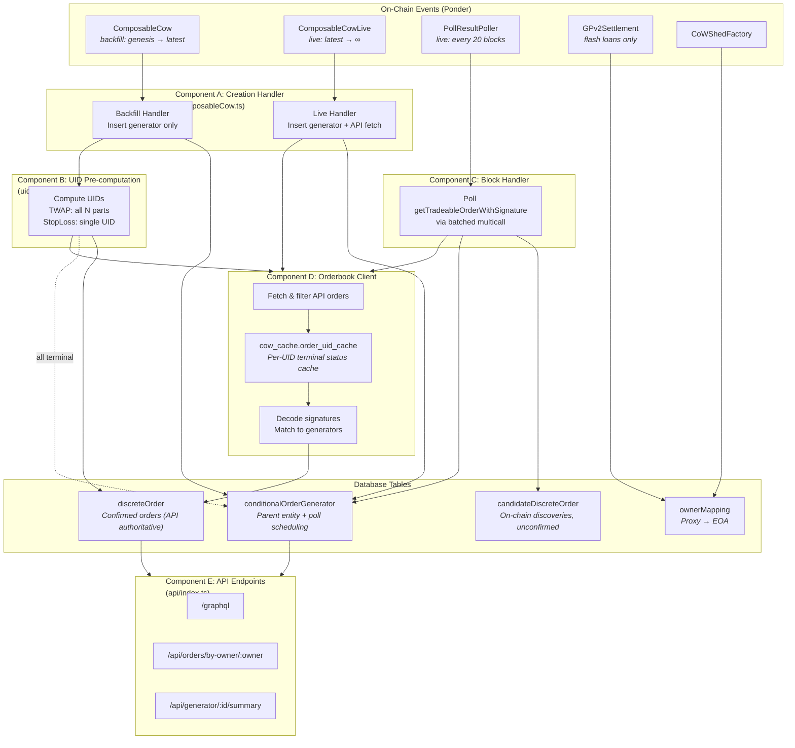
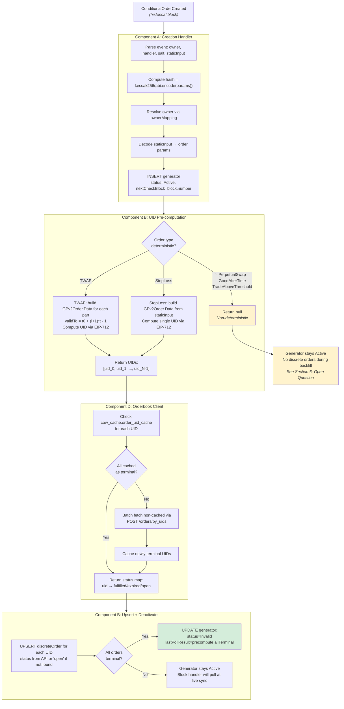
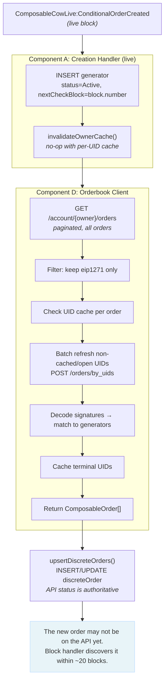
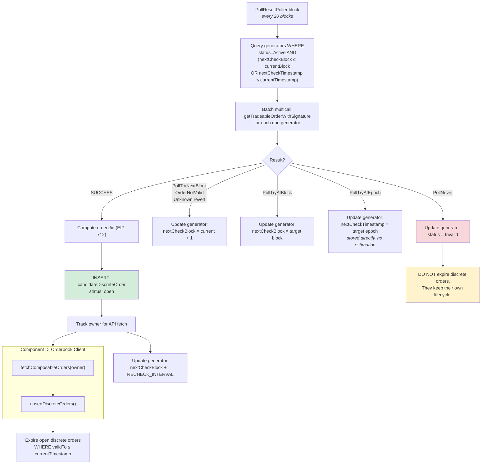
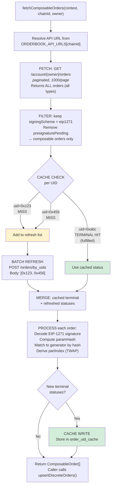
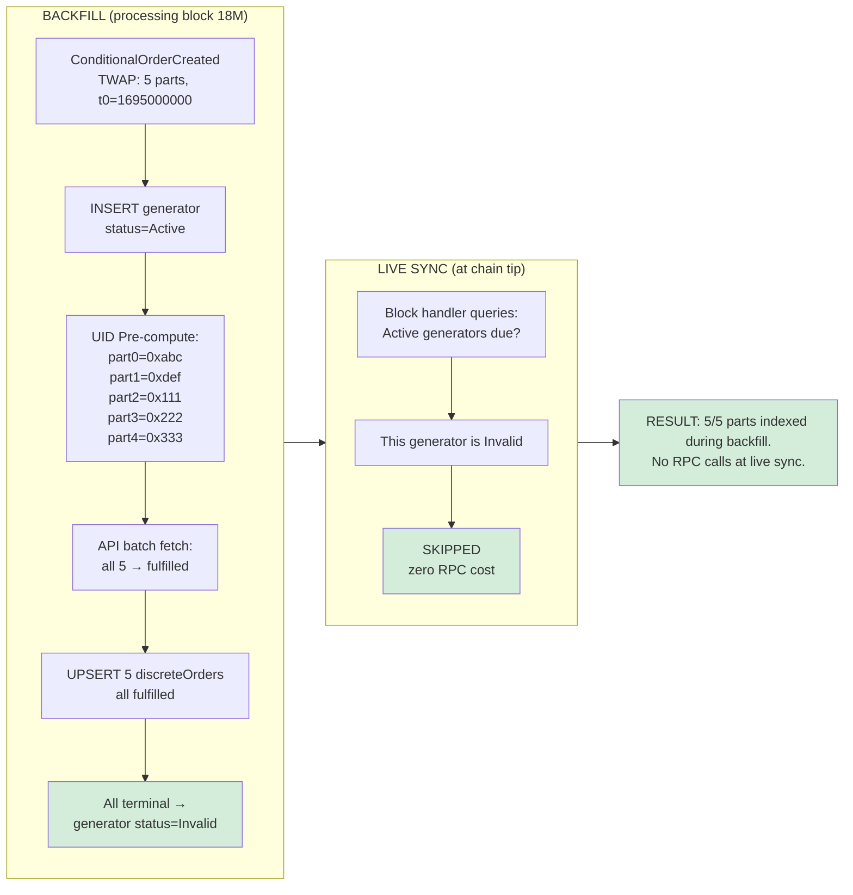
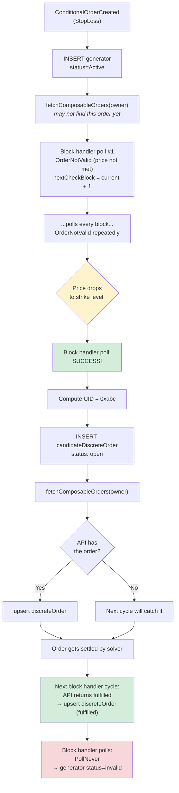
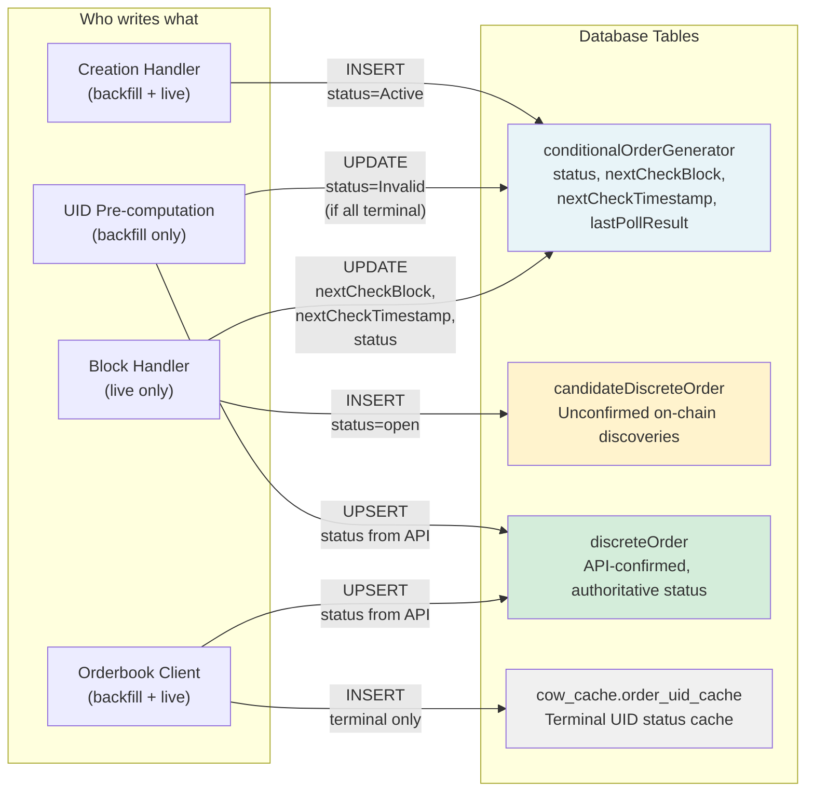

# M3 Orderbook Integration — System Architecture & Flow

This document explains how the M3 discrete order system works, what each component does, and how an order moves through the system from creation to completion. Written for team discussion.

---

## 1. Components

The system is composed of five distinct components. Each has a clear responsibility and communicates with the others through the database or direct function calls.

### Component A: Creation Handler (`composableCow.ts`)

**Responsibility**: Reacts to `ConditionalOrderCreated` events from the ComposableCoW contract. Creates the parent generator entity and, for deterministic order types, discovers discrete orders immediately.

**Runs during**: Backfill AND live sync (two separate Ponder contract entries — `ComposableCow` for historical, `ComposableCowLive` for live — both call into shared logic).

**Writes to**: `conditionalOrderGenerator`, `discreteOrder` (via UID Pre-computation during backfill, or via Orderbook Client during live sync).

### Component B: UID Pre-computation (`uidPrecompute.ts`)

**Responsibility**: For deterministic order types (TWAP, StopLoss), computes the exact order UIDs that the on-chain handler will produce — without making any RPC calls. Then uses the Orderbook Client to fetch the status of those UIDs from the API.

**Runs during**: Backfill only (called by the backfill Creation Handler).

**How it works**: TWAP and StopLoss contracts produce order data that is fully determined by the `staticInput` params encoded at creation time. Given those params, this component builds the same `GPv2Order.Data` struct the Solidity contract would build, then hashes it using EIP-712 to produce the order UID — the same UID that appears on the CoW Protocol Orderbook API. It uses `computeOrderUid()` from `orderUid.ts` (the existing UID computation function).

**Why it exists**: During backfill, the block handler is not running (it starts at `"latest"`). Without this component, historical generators would arrive at live sync with no discrete orders — the block handler would poll, get `PollNever` for completed TWAPs, and the orders would be lost forever.

**Writes to**: `discreteOrder` (with status from API), updates `conditionalOrderGenerator.status` to `Invalid` if all orders are terminal.

### Component C: Block Handler (`blockHandler.ts`)

**Responsibility**: Periodically polls the ComposableCoW contract on-chain to check which generators have tradeable orders. Manages the scheduling state (when to next check each generator) and discovers orders that are currently tradeable.

**Runs during**: Live sync only (`startBlock: "latest"`, fires every 20 blocks).

**How it works**: Queries all generators where `status = 'Active'` and `(nextCheckBlock <= currentBlock OR nextCheckTimestamp <= currentTimestamp)`. For each, calls `getTradeableOrderWithSignature` via batched multicall. The contract either returns success (order data) or reverts with a typed error (PollTryNextBlock, PollTryAtEpoch, PollNever, etc.).

**Writes to**: `candidateDiscreteOrder` (on success — the order is tradeable but may not yet be on the API), updates `conditionalOrderGenerator` scheduling fields, and triggers the Orderbook Client to fetch confirmed orders.

### Component D: Orderbook Client (`orderbookClient.ts`)

**Responsibility**: The single interface to the CoW Protocol Orderbook API. Fetches orders for an owner, filters to composable (EIP-1271) orders, matches them to on-chain generators, and upserts them into `discreteOrder`. Manages the per-UID cache.

**Runs during**: Both backfill (called by UID Pre-computation for batch UID lookups) and live sync (called by Creation Handler and Block Handler).

**Why it's a separate module**: Multiple components need to talk to the Orderbook API (creation handler at live sync, block handler after discovering tradeable orders, UID pre-computation during backfill). This module centralizes the API calls, caching, signature decoding, and generator matching so that no other component needs to know about API details.

**Writes to**: `discreteOrder`, `cow_cache.order_uid_cache`.

### Component E: API Endpoints (`api/index.ts`)

**Responsibility**: Exposes the indexed data to consumers. GraphQL (auto-generated by Ponder) plus custom REST endpoints for owner-resolved queries and execution summaries.

**Read-only**: Queries `discreteOrder`, `conditionalOrderGenerator`, `ownerMapping`.

---

## 2. Data Model

### `conditionalOrderGenerator`

The parent entity. One row per `ConditionalOrderCreated` event. Represents a "recipe" for generating discrete orders.

| Column | Purpose |
|--------|---------|
| `eventId` | Ponder event ID (PK with chainId) |
| `owner` | Contract address that owns this order (may be a CoWShed proxy) |
| `resolvedOwner` | The EOA behind the proxy (or same as owner if direct) |
| `handler`, `salt`, `staticInput`, `hash` | The on-chain order parameters |
| `orderType` | TWAP, StopLoss, PerpetualSwap, GoodAfterTime, TradeAboveThreshold, Unknown |
| `status` | **Active** (polling), **Cancelled** (on-chain removal), **Invalid** (PollNever or all orders terminal) |
| `decodedParams` | JSON with decoded staticInput (e.g., `{t0, t, n, sellToken, ...}` for TWAP) |
| `nextCheckBlock` | Block number at which the block handler should next poll this generator |
| `nextCheckTimestamp` | Unix timestamp for PollTryAtEpoch — stored directly, no block estimation |
| `lastCheckBlock`, `lastPollResult` | Audit trail for the last poll |

### `discreteOrder`

A confirmed order from the Orderbook API. One row per individual order part (e.g., each of 10 TWAP parts). This is what API consumers query.

| Column | Purpose |
|--------|---------|
| `orderUid` | 56-byte CoW Protocol order UID (PK with chainId) |
| `conditionalOrderGeneratorId` | FK to parent generator |
| `status` | **open**, **fulfilled**, **expired**, **cancelled**, **unfilled** |
| `partIndex` | For TWAP: which part number (0-indexed). Null for non-TWAP. |
| `sellAmount`, `buyAmount`, `feeAmount` | Order amounts |
| `validTo` | Unix timestamp when this order expires |
| `detectedBy` | Where first discovered: `orderbook_api` or `block_handler` |

### `candidateDiscreteOrder`

An order discovered on-chain by the block handler that may not yet exist on the Orderbook API. Same columns as `discreteOrder` but without `detectedBy`. The block handler writes here; the Orderbook Client later confirms the order by upserting it into `discreteOrder`.

### `cow_cache.order_uid_cache`

Per-UID status cache. A separate PostgreSQL schema (`cow_cache`) that survives Ponder resyncs.

| Column | Purpose |
|--------|---------|
| `chain_id`, `order_uid` | Primary key |
| `status` | Terminal status only: fulfilled, expired, cancelled |
| `fetched_at` | When it was cached |

**Only terminal statuses are cached.** An order marked `fulfilled` can never become `open` again — so the cache entry is permanent. Open orders are always re-fetched from the API.

---

## 3. Detailed Flows

### 3.1 Order Creation — Backfill

**When**: Processing historical blocks (from genesis to near chain tip).
**Ponder contract**: `ComposableCow` (the historical entry — processes all events from genesis).

**What happens step by step:**

1. **Event arrives.** Ponder delivers a `ConditionalOrderCreated` event from a historical block.

2. **Generator insert.** The Creation Handler parses the event, resolves the owner (checking if it's a CoWShed proxy), decodes the `staticInput` into order-type-specific params, and inserts a `conditionalOrderGenerator` row with `status = 'Active'` and `nextCheckBlock = event.block.number`.

3. **UID pre-computation.** The handler calls `precomputeAndDiscover()` from the UID Pre-computation component. This checks the `orderType`:

   - **TWAP**: Computes all N part UIDs. Each part's `GPv2Order.Data` is built from the decoded params — `sellAmount = partSellAmount`, `buyAmount = minPartLimit`, `validTo = t0 + (i+1) * t - 1`. When `t0 = 0` in the params, `event.block.timestamp` is used (matching the contract's `cabinet` behavior). The existing `computeOrderUid()` function hashes the order data via EIP-712 to produce the UID.

   - **StopLoss**: Computes a single UID. All order fields come directly from the decoded params — the oracle only gates execution, it doesn't change the order data.

   - **PerpetualSwap, GoodAfterTime, TradeAboveThreshold, Unknown**: Returns null (non-deterministic — depends on oracle prices or balances at execution time, or type is unrecognized).

4. **API status lookup.** For the pre-computed UIDs, the UID Pre-computation component calls `fetchOrderStatusByUids()` from the Orderbook Client. This function:
   - Checks `cow_cache.order_uid_cache` for each UID
   - UIDs found as terminal in cache → use cached status (no API call)
   - UIDs not in cache → batch-fetch via `POST /api/v1/orders/by_uids`
   - Cache any newly-terminal results

5. **Discrete order upsert.** For each pre-computed UID, a `discreteOrder` row is inserted with the status from the API. If the API returned `fulfilled`, that's stored. If the API didn't find the UID (order was never submitted to the API, or was too old), the status defaults to `open`.

6. **Generator deactivation.** If ALL pre-computed orders are terminal (fulfilled, expired, or cancelled), the generator is marked `status = 'Invalid'` with `lastPollResult = 'precompute:allTerminal'`. This means the block handler will never poll this generator at live sync — saving RPC calls for completed historical orders.

**For non-deterministic types (PerpetualSwap, etc.):** Step 3 returns null, steps 4-6 are skipped. The generator remains `Active` and will be polled by the block handler at live sync. See the open question in Section 6.

### 3.2 Order Creation — Live Sync

**When**: Processing blocks at the chain tip (real-time).
**Ponder contract**: `ComposableCowLive` (starts at `"latest"` — only fires for new blocks).

**What happens step by step:**

1. **Generator insert.** Same as backfill — insert `conditionalOrderGenerator` with `status = 'Active'`.

2. **Cache invalidation.** The handler calls `invalidateOwnerCache()`. With the current per-UID cache, this is a no-op — new orders won't have cache entries, so they'll be fetched fresh. (Note: this may change if we add owner-level caching later.)

3. **Full owner fetch via Orderbook Client.** The handler calls `fetchComposableOrders(context, chainId, owner)`. This does a full fetch (see Section 3.4 below) — the newly created order may or may not be on the API yet (depends on watch-tower latency), but any existing orders for this owner will be discovered and upserted into `discreteOrder`.

**Why a full owner fetch instead of UID pre-computation at live sync?** At live sync, the order was just created — it may not be on the API yet. The full owner fetch catches any other orders this owner has, and the block handler will discover the new order when it becomes tradeable (within 20 blocks).

### 3.3 Block Handler — Live Polling

**When**: Every 20 blocks at live sync (`PollResultPoller` with `startBlock: "latest"`).

The block handler's job is to poll the ComposableCoW contract for each active generator to determine if the order is currently tradeable and to manage scheduling.

**Step 1 — Find due orders:**

Query `conditionalOrderGenerator` where:
- `status = 'Active'`
- AND (`nextCheckBlock <= currentBlock` OR (`nextCheckTimestamp IS NOT NULL` AND `nextCheckTimestamp <= currentTimestamp`))

This covers both block-based scheduling (most cases) and timestamp-based scheduling (PollTryAtEpoch for TWAP start times).

**Step 2 — Batch multicall:**

For all due orders, call `getTradeableOrderWithSignature(owner, params, "0x", [])` on the ComposableCoW contract. `allowFailure: true` so reverts come back as typed errors.

**Step 3 — Process results:**

Each result is one of:

| Result | What it means | What the handler does |
|--------|--------------|----------------------|
| **Success** | The order is tradeable right now | Compute `orderUid` via EIP-712, insert into `candidateDiscreteOrder` as "open", track owner for API fetch, schedule recheck in 20 blocks |
| **PollTryNextBlock** | Not ready yet, try next block | Set `nextCheckBlock = currentBlock + 1` |
| **PollTryAtBlock(N)** | Try at a specific block | Set `nextCheckBlock = N` |
| **PollTryAtEpoch(T)** | Try at a Unix timestamp | Set `nextCheckTimestamp = T` directly (no block estimation) |
| **PollNever(reason)** | Generator is permanently done | Set `status = 'Invalid'`. Do NOT expire discrete orders — they keep their own lifecycle. |
| **OrderNotValid** | Transient — not tradeable | Treated as TryNextBlock |
| **Unknown revert** | Unexpected error | Treated as TryNextBlock (never crash) |

**Step 4 — API fetch for tradeable owners:**

For each owner that had at least one success result, call `fetchComposableOrders()` from the Orderbook Client. This discovers/updates discrete orders from the API — the authoritative source for status. The `candidateDiscreteOrder` row from step 3 is a "best effort" early detection; the `discreteOrder` row from the API is the confirmed version.

**Step 5 — Expire open orders:**

Update all `discreteOrder` rows where `status = 'open'` and `validTo <= currentTimestamp` to `status = 'expired'`.

### 3.4 Orderbook Client — Fetch & Cache Logic

The Orderbook Client is called by three callers: the live Creation Handler, the Block Handler, and the UID Pre-computation component. It handles all API communication, signature decoding, generator matching, and caching.

**`fetchComposableOrders(context, chainId, owner)` flow:**

```
┌─────────────────────────────────────────────────────────────────┐
│  ORDERBOOK CLIENT (orderbookClient.ts)                          │
│                                                                 │
│  1. Resolve API URL from ORDERBOOK_API_URLS[chainId]            │
│                                                                 │
│  2. FETCH: GET /api/v1/account/{owner}/orders                   │
│     (paginated, 1000/page, loop until last page)                │
│     Returns ALL orders for this owner (all types, all schemes)  │
│                                                                 │
│  3. FILTER: Keep only signingScheme = "eip1271"                 │
│     Skip "presignaturePending" status                           │
│     (This removes non-composable orders — limit orders,         │
│      presign orders, etc.)                                      │
│                                                                 │
│  4. CACHE CHECK: For each composable order,                     │
│     look up cow_cache.order_uid_cache(chainId, uid)             │
│     ┌─────────────────────────────────┐                         │
│     │ Terminal HIT → use cached       │                         │
│     │   status, skip this UID         │                         │
│     │                                 │                         │
│     │ MISS or OPEN → add to           │                         │
│     │   "needs refresh" list          │                         │
│     └─────────────────────────────────┘                         │
│                                                                 │
│  5. BATCH REFRESH: POST /api/v1/orders/by_uids                  │
│     (only for UIDs in the "needs refresh" list)                 │
│     Returns current status for each UID                         │
│                                                                 │
│  6. MERGE: Combine cached terminal statuses                     │
│     with refreshed statuses                                     │
│                                                                 │
│  7. PROCESS each composable order:                              │
│     - Decode EIP-1271 signature → handler, salt, staticInput    │
│     - Compute paramHash → match to generator by hash            │
│     - Derive TWAP partIndex if applicable                       │
│     → Produce ComposableOrder[]                                 │
│                                                                 │
│  8. CACHE WRITE: Store newly-terminal UIDs                      │
│     in cow_cache.order_uid_cache                                │
│                                                                 │
│  9. RETURN ComposableOrder[] to caller                          │
└─────────────────────────────────────────────────────────────────┘
```

The caller then calls `upsertDiscreteOrders()` to write the results into the `discreteOrder` table with `onConflictDoUpdate` — so the API's authoritative status always wins.

**`fetchOrderStatusByUids(context, chainId, uids)` flow:**

A simpler path used by the UID Pre-computation component. Instead of fetching by owner and filtering, it directly:
1. Checks the UID cache for each UID
2. Batch-fetches non-cached UIDs via `POST /orders/by_uids`
3. Caches terminal results
4. Returns a `Map<uid, status>`

This is more efficient when we already know the UIDs (pre-computed from decoded params) and just need their current status.

---

## 4. Order Type Lifecycles

Each order type has a different lifecycle depending on its trigger mechanism and determinism.

### TWAP — Deterministic, multi-part

A TWAP order creates N discrete orders (parts), one at a time, each valid for a fixed window.

**During backfill:**
- Generator created → UID Pre-computation computes all N part UIDs → batch-fetches from API → upserts `discreteOrder` for each part with the API's status (likely `fulfilled` or `expired` for old TWAPs).
- If all parts are terminal → generator marked `Invalid` → block handler will never poll it.

**During live sync:**
- Generator created → Orderbook Client fetches owner's orders → discovers any existing parts.
- Block handler polls → first poll may get `PollTryAtEpoch(t0)` if TWAP hasn't started yet → stores `nextCheckTimestamp = t0`.
- When `t0` arrives → poll returns Success with part 0's order data → `candidateDiscreteOrder` created → API fetch confirms it → `discreteOrder` created.
- Part 0 fills → API shows `fulfilled` → next poll returns Success with part 1 → repeat.
- All parts done → `PollNever` → generator `status = 'Invalid'`.

**Key characteristic:** Each part has an identical `sellAmount` and `buyAmount` (from `partSellAmount` and `minPartLimit`). Only `validTo` changes between parts.

### StopLoss — Deterministic, single-part

A StopLoss order creates exactly one discrete order, which triggers when an oracle price condition is met.

**During backfill:**
- Generator created → UID Pre-computation computes the single UID → fetches status from API.
- If `fulfilled` or `expired` → generator marked `Invalid`.

**During live sync:**
- Block handler polls → `OrderNotValid` (price not met yet) → retries every block.
- Price condition met → Success → `candidateDiscreteOrder` created → API fetch confirms it.
- The order data is always the same (amounts, tokens, `validTo` all from `staticInput`) — the oracle only gates whether the order becomes tradeable.

**Key characteristic:** The oracle is a guard, not an input. The order UID is deterministic from the moment of creation.

### PerpetualSwap — Non-deterministic, repeating

Cannot pre-compute UIDs — order amounts depend on oracle prices at execution time. The block handler is the only discovery mechanism.

**During backfill:** Generator created with `status = 'Active'`, no discrete orders.
**During live sync:** Block handler polls → Success during active windows → `candidateDiscreteOrder` → API fetch → `discreteOrder`.

### GoodAfterTime / TradeAboveThreshold — Non-deterministic, single-part

Similar to StopLoss in structure, but the order amounts may depend on external state (balance for TradeAboveThreshold, price checker for GoodAfterTime). Cannot pre-compute UIDs.

---

## 5. End-to-End Lifecycle of an Order

This section walks through the complete lifecycle of a TWAP order and a StopLoss order, explaining every status transition and which component is responsible.

### Scenario A: A TWAP with 5 parts, created 2 months ago

The indexer starts syncing from genesis. This TWAP was created, executed all 5 parts, and completed months before we started indexing.

1. **Block 18,000,000 (backfill):** Ponder delivers `ConditionalOrderCreated`. The Creation Handler inserts the generator with `status = 'Active'` and decoded params: `{t0: 1695000000, t: 3600, n: 5, partSellAmount: "1000000000", ...}`.

2. **UID Pre-computation runs immediately.** It sees `orderType = "TWAP"` and computes 5 UIDs:
   - Part 0: `validTo = 1695000000 + 1*3600 - 1 = 1695003599` → UID = `0xabc...`
   - Part 1: `validTo = 1695007199` → UID = `0xdef...`
   - ...and so on for parts 2-4.

3. **API status lookup.** Calls `fetchOrderStatusByUids()` with the 5 UIDs.
   - First time: all 5 are fetched from `POST /orders/by_uids`.
   - API returns: all 5 are `fulfilled`.
   - All 5 are cached in `cow_cache.order_uid_cache` as terminal.

4. **Discrete order upsert.** 5 `discreteOrder` rows are created with `status = 'fulfilled'`.

5. **Generator deactivation.** All 5 are terminal → generator `status = 'Invalid'`, `lastPollResult = 'precompute:allTerminal'`.

6. **At live sync:** The block handler queries for `Active` generators — this one is `Invalid`, so it's skipped. Zero RPC cost.

**Result:** The user's completed TWAP is fully indexed during backfill. All 5 parts visible in the API with correct statuses. No wasted RPC calls at live sync.

### Scenario B: A StopLoss, created during live sync, price triggers later

1. **Live block:** `ConditionalOrderCreated` fires. The live Creation Handler inserts the generator and calls `fetchComposableOrders()` for this owner. The StopLoss order may not be on the API yet (just created), but any other orders from this owner are discovered.

2. **Block handler (20 blocks later):** Polls `getTradeableOrderWithSignature` → gets `OrderNotValid` (oracle price hasn't hit the strike). Sets `nextCheckBlock = currentBlock + 1`.

3. **Block handler (next block, and the next, and the next...):** Keeps getting `OrderNotValid`. Retries each block.

4. **Price drops to strike level.** Block handler polls → **Success!** The contract returns the order data. The handler:
   - Computes `orderUid` via EIP-712
   - Inserts into `candidateDiscreteOrder` with `status = 'open'`
   - Triggers API fetch for this owner

5. **API fetch.** The watch-tower may have already submitted the order to the API. Two outcomes:
   - **API has it:** `discreteOrder` is upserted with status from API (likely `open`, soon to be `fulfilled`).
   - **API doesn't have it yet:** No match. The `candidateDiscreteOrder` is the only record. Next poll cycle, the API will likely have it.

6. **Order fills.** The solver settles the trade on-chain. The API updates the order status to `fulfilled`.

7. **Next block handler cycle.** API fetch finds the order as `fulfilled` → `discreteOrder` upserted with `status = 'fulfilled'`.

8. **Block handler polls again.** `getTradeableOrderWithSignature` returns `PollNever` (order was a one-shot, now done). Generator `status = 'Invalid'`.

**Result:** The StopLoss order was discovered when it became tradeable, confirmed via the API, and marked fulfilled when settled. The `candidateDiscreteOrder` served as a "heads up" that the order existed before the API confirmed it.

### Scenario C: A PerpetualSwap, created 3 months ago (non-deterministic)

1. **Backfill:** Generator created with `status = 'Active'`. UID Pre-computation returns `null` (non-deterministic). No discrete orders created.

2. **Live sync:** Block handler polls → Success (if the swap is currently in an active window) → `candidateDiscreteOrder` created → API fetch → `discreteOrder` upserted.

3. **Between windows:** Block handler polls → `OrderNotValid` → retries next block.

4. **Ongoing:** PerpetualSwap keeps producing new orders periodically. Each new active window generates a new `candidateDiscreteOrder` and a new `discreteOrder` via API.

**Gap:** Discrete orders from the 3 months before we started indexing are NOT captured. The API may have them, but we don't fetch by owner during backfill for non-deterministic types. See Section 6.

---

## 6. Open Question: Non-Deterministic Historical Orders

**What's solved:** TWAP and StopLoss orders from before the indexer started are fully captured via UID pre-computation during backfill.

**What's not solved:** PerpetualSwap, GoodAfterTime, and TradeAboveThreshold orders from before the indexer started. These types cannot have UIDs pre-computed, so their historical discrete orders are not discovered during backfill.

**Impact:** These order types are rare compared to TWAP. The generator is created and visible, but its historical discrete orders are missing.

### Options:

**Option A — Fetch from API by owner for non-deterministic types during backfill.**
During backfill, when we encounter a non-deterministic generator, call `fetchComposableOrders(owner)` to discover all orders from the API. This adds API calls but only for the handful of non-TWAP/non-StopLoss owners.

**Option B — Accept the gap.**
PerpetualSwap and TradeAboveThreshold are rare. The generator is indexed correctly, and if the order is still active at live sync, it will be discovered by the block handler. Only historical (completed) discrete orders are missing.

**Option C — One-time bootstrap at the start of live sync.**
When the indexer transitions from backfill to live, find all `Active` generators with no `discreteOrder` rows, fetch from API for their owners. Runs once, fills the gap.

**Recommendation for team decision:** Option B is simplest. Option A adds minimal complexity if completeness is required. Option C is a middle ground.

---

## 7. Visual Diagrams (Mermaid)

### Diagram 1: System Architecture — Components & Data Flow



---

### Diagram 2: Backfill Flow — Deterministic (TWAP / StopLoss)



---

### Diagram 3: Live Sync Flow — New Order Created



---

### Diagram 4: Block Handler — Live Polling Cycle



---

### Diagram 5: Orderbook Client — Cache Decision Flow



---

### Diagram 6: Complete TWAP Lifecycle — Historical (backfill + live)



---

### Diagram 7: Complete StopLoss Lifecycle — Live Sync



---

### Diagram 8: Data Flow Between Tables


