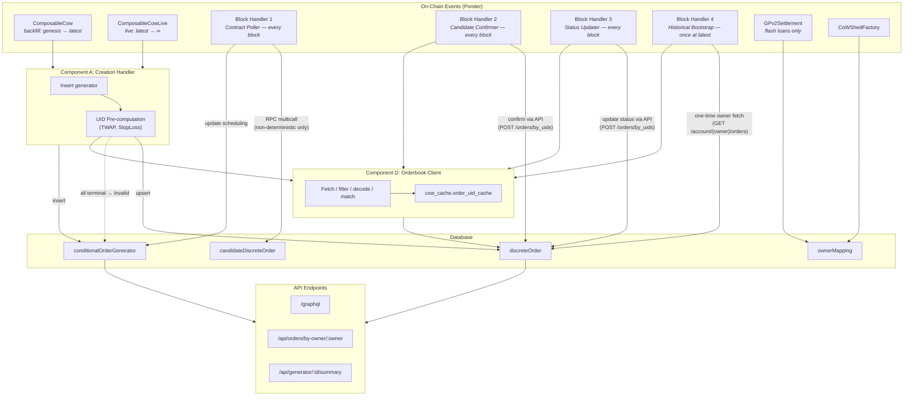
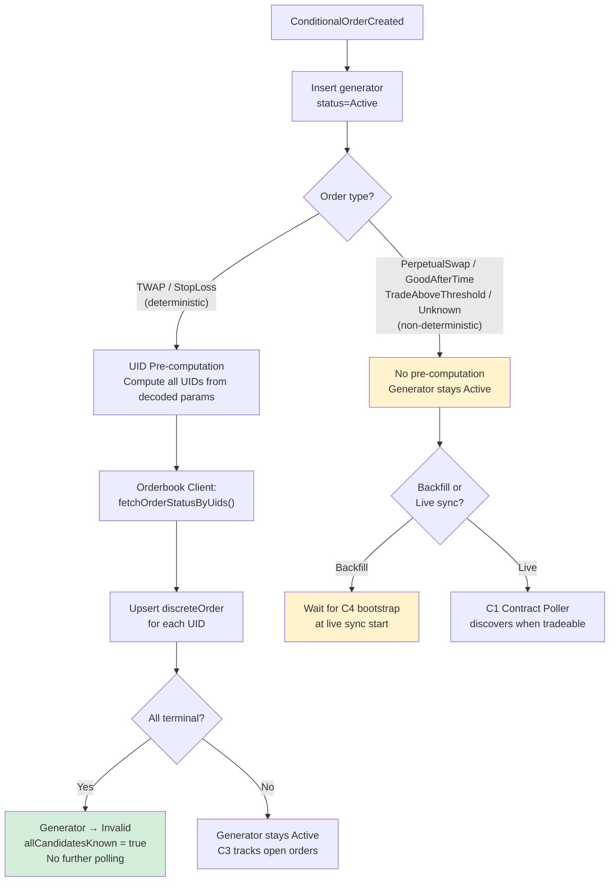
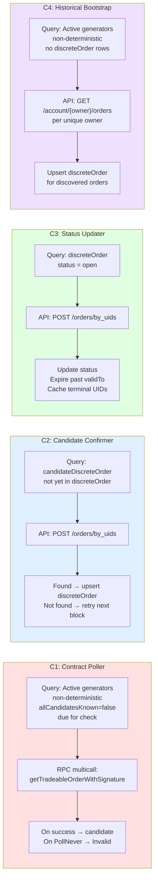
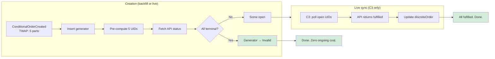
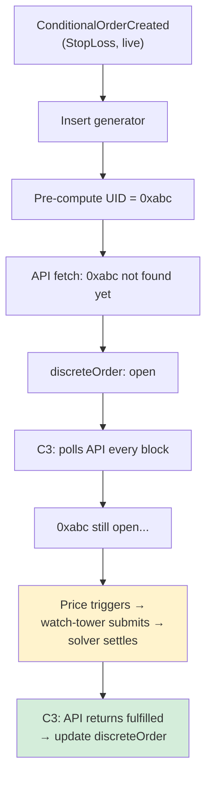
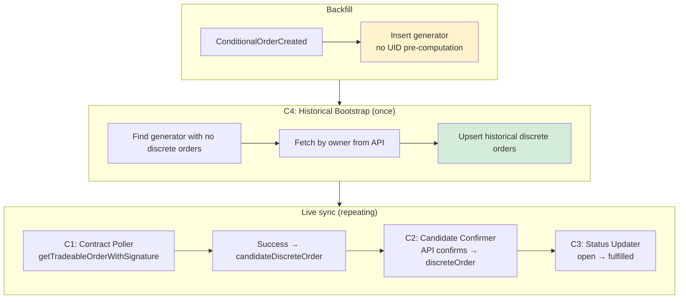
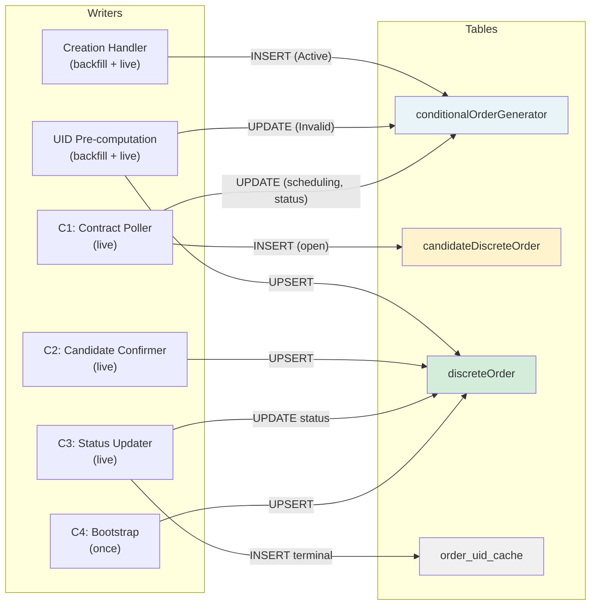

# M3 Orderbook Integration — System Architecture & Flow

This document explains how the M3 discrete order system works, what each component does, and how an order moves through the system from creation to completion. Written for team discussion.

---

## 1. Components

The system has seven components. Each has a single responsibility.

### Component A: Creation Handler (`composableCow.ts`)

**Responsibility**: Reacts to `ConditionalOrderCreated` events. Creates the generator entity. For deterministic order types, pre-computes all UIDs and fetches their status from the API immediately — at both backfill and live sync.

**Runs during**: Backfill AND live sync (two Ponder contract entries: `ComposableCow` for historical, `ComposableCowLive` for live).

**Key behavior difference by order type**:
- **Deterministic (TWAP, StopLoss)**: Pre-computes UIDs → fetches status from API → upserts `discreteOrder` → if all terminal, marks generator `Invalid` (no further polling needed). This happens at both backfill and live sync.
- **Non-deterministic (PerpetualSwap, GoodAfterTime, TradeAboveThreshold, Unknown)**: Inserts generator only. Discrete orders will be discovered by the block handlers at live sync.

**Writes to**: `conditionalOrderGenerator`, `discreteOrder` (via UID Pre-computation).

### Component B: UID Pre-computation (`uidPrecompute.ts`)

**Responsibility**: For deterministic order types, builds the exact `GPv2Order.Data` struct that the on-chain handler would produce, hashes it via EIP-712 to produce the order UID, then uses the Orderbook Client to fetch the status.

**Why it works**: TWAP and StopLoss contracts produce order data that is fully determined by the `staticInput` params encoded at creation time. The oracle calls in StopLoss only gate whether the order is tradeable — they don't change the order data itself. For TWAP, each part has a deterministic `validTo` based on `t0`, `t`, and the part index.

**Used by**: Creation Handler (both backfill and live). Also available to any future component that needs to know UIDs without RPC calls.

**Writes to**: `discreteOrder`, updates `conditionalOrderGenerator.status` to `Invalid` if all orders are terminal.

### Component C1: Contract Poller (`blockHandler.ts` — handler 1)

**Responsibility**: Polls `getTradeableOrderWithSignature` on the ComposableCoW contract for **non-deterministic** active generators only. Creates candidate discrete orders when the contract returns success. Manages generator scheduling state (nextCheckBlock, nextCheckTimestamp, status).

**When it runs**: Every block at live sync.

**What it polls**: Generators where:
- `status = 'Active'`
- `orderType` is non-deterministic (PerpetualSwap, GoodAfterTime, TradeAboveThreshold, Unknown)
- `allCandidatesKnown = false`
- Due: `nextCheckBlock <= currentBlock` OR `nextCheckTimestamp <= currentTimestamp`

**Why only non-deterministic?** Deterministic orders (TWAP, StopLoss) have their UIDs pre-computed at creation time. There is no need to call the contract — we already know the UIDs and can poll the API directly. This saves RPC calls for the majority of orders.

**Writes to**: `candidateDiscreteOrder`, updates `conditionalOrderGenerator` scheduling fields.

### Component C2: Candidate Confirmer (`blockHandler.ts` — handler 2)

**Responsibility**: Checks if candidate discrete orders exist on the Orderbook API. When confirmed, moves them to `discreteOrder`.

**When it runs**: Every block at live sync.

**How it works**: Queries `candidateDiscreteOrder` rows that don't yet have a corresponding `discreteOrder` row. Batch-fetches their UIDs from the API via `POST /orders/by_uids`. If the API has the order, upserts into `discreteOrder` with the API's authoritative status.

**Why a separate handler?** The Contract Poller (C1) discovers orders on-chain, but the API may not have them yet (watch-tower submission delay). This handler polls the API repeatedly until the candidate is confirmed. Separation means C1 focuses on RPC, C2 focuses on API — different cost profiles, can be tuned independently.

**Writes to**: `discreteOrder`.

### Component C3: Status Updater (`blockHandler.ts` — handler 3)

**Responsibility**: Polls the API for status updates on non-terminal discrete orders. Detects when open orders become fulfilled, expired, or cancelled.

**When it runs**: Every block at live sync.

**How it works**: Queries `discreteOrder` rows where `status = 'open'`. Batch-fetches their UIDs from the API. Updates status to the API's authoritative value. Also expires orders where `validTo <= currentTimestamp`.

**Why a separate handler?** This is pure API work — no RPC calls. It runs for ALL open discrete orders regardless of how they were discovered (pre-computation, contract poller, or owner fetch).

**Writes to**: `discreteOrder`, `cow_cache.order_uid_cache` (caches newly terminal).

### Component C4: Historical Bootstrap (`blockHandler.ts` — handler 4)

**Responsibility**: One-time discovery of historical discrete orders for non-deterministic generators that were created during backfill. Runs once at the start of live sync (`startBlock = endBlock = "latest"`).

**How it works**: Finds all generators with `status = 'Active'` and no `discreteOrder` rows and non-deterministic `orderType`. For each unique owner, calls `fetchComposableOrders(owner)` from the Orderbook Client, which fetches all orders by owner, filters to composable, and upserts into `discreteOrder`.

**Why it exists**: Non-deterministic generators created during backfill have no discrete orders because UID pre-computation doesn't work for them and the contract poller only runs at live sync. This one-time bootstrap fills the gap. After running once, it has no further work to do.

**Writes to**: `discreteOrder`.

### Component D: Orderbook Client (`orderbookClient.ts`)

**Responsibility**: The single interface to the CoW Protocol Orderbook API. All API calls go through this module. It handles fetching, filtering, EIP-1271 signature decoding, generator matching, and per-UID caching.

**Public functions**:
- `fetchComposableOrders(context, chainId, owner)` — full owner fetch, filter, decode, match, cache
- `fetchOrderStatusByUids(context, chainId, uids)` — batch UID status lookup with cache
- `upsertDiscreteOrders(context, chainId, orders)` — write to discreteOrder table

**Writes to**: `discreteOrder`, `cow_cache.order_uid_cache`.

### Component E: API Endpoints (`api/index.ts`)

**Responsibility**: Exposes data to consumers. Read-only.

- `/graphql` — auto-generated by Ponder, all tables with filtering and relations
- `/api/orders/by-owner/:owner` — discrete orders resolved through ownerMapping (CoWShed proxies)
- `/api/generator/:eventId/execution-summary` — count breakdown by status

---

## 2. Data Model

### `conditionalOrderGenerator`

The parent entity. One row per `ConditionalOrderCreated` event.

| Column | Purpose |
|--------|---------|
| `eventId` | Ponder event ID (PK with chainId) |
| `owner` | Contract address (may be a CoWShed proxy) |
| `resolvedOwner` | The EOA behind the proxy |
| `handler`, `salt`, `staticInput`, `hash` | On-chain order parameters |
| `orderType` | TWAP, StopLoss, PerpetualSwap, GoodAfterTime, TradeAboveThreshold, Unknown |
| `status` | **Active** (needs polling), **Cancelled** (on-chain removal), **Invalid** (completed or PollNever) |
| `decodedParams` | JSON with decoded staticInput |
| `nextCheckBlock` | When the contract poller should next check this generator |
| `nextCheckTimestamp` | For PollTryAtEpoch — stored directly, no estimation |
| `lastCheckBlock`, `lastPollResult` | Audit trail |
| `allCandidatesKnown` | Boolean — when true, contract poller skips this generator (all UIDs discovered) |

### `discreteOrder`

Confirmed orders. API-authoritative status. What consumers query.

| Column | Purpose |
|--------|---------|
| `orderUid` | CoW Protocol order UID (PK with chainId) |
| `conditionalOrderGeneratorId` | FK to parent generator |
| `status` | **open**, **fulfilled**, **expired**, **cancelled**, **unfilled** |
| `partIndex` | TWAP part number (0-indexed). Null for non-TWAP. |
| `sellAmount`, `buyAmount`, `feeAmount` | Order amounts |
| `validTo` | Unix timestamp when this order expires |
| `creationDate` | When the order was created |

### `candidateDiscreteOrder`

Orders discovered on-chain by the Contract Poller but not yet confirmed on the Orderbook API. Same schema as `discreteOrder`. The Candidate Confirmer (C2) promotes them to `discreteOrder` once the API has them.

### `cow_cache.order_uid_cache`

Per-UID terminal status cache. Survives Ponder resyncs (external `cow_cache` schema).

| Column | Purpose |
|--------|---------|
| `chain_id`, `order_uid` | Primary key |
| `status` | Terminal only: fulfilled, expired, cancelled |
| `fetched_at` | When it was cached |

---

## 3. Detailed Flows

### 3.1 Order Creation — Deterministic Types (TWAP, StopLoss)

**Applies to both backfill and live sync.** The flow is the same because we can compute UIDs without RPC calls.

1. **Event arrives.** `ConditionalOrderCreated` from either `ComposableCow` (historical) or `ComposableCowLive` (live).

2. **Generator insert.** Parse event, resolve owner, decode staticInput, insert `conditionalOrderGenerator` with `status = 'Active'`.

3. **UID pre-computation.** Call `precomputeAndDiscover()`:
   - **TWAP**: Build `GPv2Order.Data` for each of N parts. `validTo = t0 + (i+1)*t - 1` (span=0) or `t0 + i*t + span - 1` (span>0). When `t0=0`, use `event.block.timestamp`. Hash each via EIP-712 → N UIDs.
   - **StopLoss**: Build single `GPv2Order.Data` from decoded params. All fields from staticInput. Hash via EIP-712 → 1 UID.

4. **API status lookup.** Call `fetchOrderStatusByUids()`:
   - Check `order_uid_cache` for each UID
   - Cached terminal → use cached (no API call)
   - Not cached → batch-fetch via `POST /orders/by_uids`
   - Cache newly terminal results

5. **Upsert discrete orders.** For each UID, insert/update `discreteOrder` with API status. If not found on API, defaults to `open`.

6. **Generator deactivation.** If ALL orders are terminal → set `status = 'Invalid'`, `allCandidatesKnown = true`, `lastPollResult = 'precompute:allTerminal'`. No further polling needed.

**Result**: Deterministic orders are fully discovered at creation time. They never need the Contract Poller (C1). The Status Updater (C3) handles any open orders that haven't settled yet.

### 3.2 Order Creation — Non-Deterministic Types

**Applies to both backfill and live sync.**

1. **Generator insert.** Same as above.

2. **UID pre-computation returns null.** Can't compute UIDs for PerpetualSwap, GoodAfterTime, TradeAboveThreshold, or Unknown types.

3. **Generator stays Active.** The Contract Poller (C1) will pick it up at live sync.

**During backfill**: No discrete orders created. The Historical Bootstrap (C4) fills this gap at the start of live sync.

**During live sync**: The Contract Poller discovers orders when `getTradeableOrderWithSignature` returns success.

### 3.3 Contract Poller (C1) — Non-Deterministic Orders

**When**: Every block at live sync.

1. **Find due generators.** Query where `status = 'Active'` AND `allCandidatesKnown = false` AND non-deterministic orderType AND (`nextCheckBlock <= currentBlock` OR `nextCheckTimestamp <= currentTimestamp`).

2. **Batch multicall.** Call `getTradeableOrderWithSignature(owner, params, "0x", [])` on ComposableCoW.

3. **Process results:**

| Result | Action |
|--------|--------|
| **Success** | Compute `orderUid`, INSERT `candidateDiscreteOrder` (open), schedule recheck |
| **PollTryNextBlock / OrderNotValid / Unknown** | `nextCheckBlock = currentBlock + 1` |
| **PollTryAtBlock(N)** | `nextCheckBlock = N` |
| **PollTryAtEpoch(T)** | `nextCheckTimestamp = T` |
| **PollNever(reason)** | `status = 'Invalid'`. Do NOT expire discrete orders. |

4. **Note on `allCandidatesKnown`**: For non-deterministic single-part orders (StopLoss created at live, GoodAfterTime, TradeAboveThreshold), once the contract returns success once, set `allCandidatesKnown = true` — the order UID is now known and C2/C3 handle the rest. For repeating orders (PerpetualSwap), this flag stays false because new orders keep appearing.

### 3.4 Candidate Confirmer (C2) — Promoting Candidates

**When**: Every block at live sync.

1. **Find unconfirmed candidates.** Query `candidateDiscreteOrder` rows whose `orderUid` does NOT exist in `discreteOrder`.

2. **Batch-fetch from API.** Call `POST /orders/by_uids` for the unconfirmed UIDs.

3. **For each found on API:** Upsert into `discreteOrder` with the API's authoritative status.

4. **For each NOT found:** Leave as candidate. Will be checked again next block. The watch-tower may not have submitted it yet.

### 3.5 Status Updater (C3) — Tracking Open Orders

**When**: Every block at live sync.

1. **Find open discrete orders.** Query `discreteOrder` where `status = 'open'`.

2. **Batch-fetch from API.** Call `POST /orders/by_uids`.

3. **Update statuses.** If the API says `fulfilled` → update. If `expired` or `cancelled` → update. Cache terminal UIDs in `order_uid_cache`.

4. **Expire by validTo.** Any `discreteOrder` where `status = 'open'` and `validTo <= currentTimestamp` → set to `expired`.

### 3.6 Historical Bootstrap (C4) — One-Time Discovery

**When**: Once, at `startBlock = endBlock = "latest"`.

1. **Find generators with missing orders.** Query `conditionalOrderGenerator` where `status = 'Active'` AND no `discreteOrder` rows exist AND `orderType` is non-deterministic.

2. **Fetch by owner.** For each unique owner, call `fetchComposableOrders(owner)` from the Orderbook Client. This fetches all orders by owner, filters to composable, decodes signatures, matches to generators, and upserts into `discreteOrder`.

3. **Done.** This handler fires once and has no further work. It fills the gap for PerpetualSwap/GoodAfterTime/TradeAboveThreshold generators created during backfill.

### 3.7 Orderbook Client — Fetch & Cache Logic

The Orderbook Client is used by all other components. Two main entry points:

**`fetchComposableOrders(context, chainId, owner)`** — Full owner fetch:

1. Resolve API URL from `ORDERBOOK_API_URLS[chainId]`
2. `GET /account/{owner}/orders` (paginated, 1000/page)
3. Filter: keep `signingScheme = "eip1271"`, skip `presignaturePending`
4. For each composable order: check `order_uid_cache`
   - Terminal HIT → use cached status (no API call for this UID)
   - MISS or OPEN → add to "needs refresh" list
5. Batch refresh via `POST /orders/by_uids`
6. Decode EIP-1271 signatures → match to generators by hash → derive partIndex
7. Cache newly terminal UIDs
8. Return `ComposableOrder[]`

**`fetchOrderStatusByUids(context, chainId, uids)`** — Batch UID lookup:

1. Check `order_uid_cache` for each UID
2. Batch-fetch non-cached via `POST /orders/by_uids`
3. Cache terminal results
4. Return `Map<uid, status>`

---

## 4. Order Type Lifecycles

### TWAP — Deterministic, multi-part

**Backfill:** Generator created → all N part UIDs pre-computed → API status fetched → `discreteOrder` rows created → if all terminal, generator marked Invalid.

**Live sync:** Same as backfill (UID pre-computation works at both). If some parts are still open, C3 (Status Updater) tracks them until fulfilled/expired.

**The Contract Poller (C1) is NEVER involved for TWAP.** All discovery happens via UID pre-computation.

### StopLoss — Deterministic, single-part

**Backfill:** Generator created → single UID pre-computed → API status fetched → `discreteOrder` created → if terminal, generator marked Invalid.

**Live sync:** Same as backfill. If the order is still open (price hasn't triggered yet), C3 tracks it. The Contract Poller is not involved.

**Key insight:** We don't need to call `getTradeableOrderWithSignature` for StopLoss. We know the UID from creation. The API will show `fulfilled` once the watch-tower submits and the solver settles.

### PerpetualSwap — Non-deterministic, repeating

**Backfill:** Generator created, no discrete orders. Historical Bootstrap (C4) discovers them at live sync start.

**Live sync:** Contract Poller (C1) polls every block → success during active windows → candidate created → C2 confirms on API → C3 tracks until fulfilled.

### GoodAfterTime / TradeAboveThreshold — Non-deterministic, single-part

**Backfill:** Generator created, no discrete orders. Historical Bootstrap (C4) discovers them.

**Live sync:** Contract Poller (C1) polls → success when condition met → candidate → C2 confirms → after first success, `allCandidatesKnown = true` → C1 stops polling this generator.

---

## 5. End-to-End Scenarios

### Scenario A: TWAP with 5 parts, created 2 months ago (backfill)

1. Block 18M: `ConditionalOrderCreated`. Generator inserted. UID Pre-computation computes 5 UIDs.
2. API batch fetch: all 5 → `fulfilled`. Cached in `order_uid_cache`.
3. 5 `discreteOrder` rows created (all fulfilled).
4. Generator → `Invalid` (`allCandidatesKnown = true`).
5. **At live sync**: Contract Poller skips this generator. Status Updater has nothing to update. Zero ongoing cost.

### Scenario B: StopLoss, created at live sync, price triggers 3 hours later

1. Live block: `ConditionalOrderCreated`. Generator inserted. UID Pre-computed = `0xabc...`.
2. API fetch: `0xabc` not found (watch-tower hasn't submitted yet). `discreteOrder` inserted as `open`.
3. **C3 (Status Updater) polls every block**: `0xabc` → API still not found or `open`.
4. 3 hours later: price triggers, watch-tower submits, solver settles.
5. **C3 polls**: `0xabc` → `fulfilled`. `discreteOrder` updated. Cached as terminal.
6. Generator stays Active until block handler checks and gets `PollNever` → `Invalid`.

**Note:** The Contract Poller (C1) is NOT involved. The UID was known from creation. Status tracking is pure API work.

### Scenario C: PerpetualSwap, created 3 months ago (non-deterministic)

1. Backfill: Generator created, `status = 'Active'`. UID Pre-computation returns null.
2. **C4 (Historical Bootstrap) at live sync start**: Finds this generator has no `discreteOrder` rows. Fetches by owner from API. Discovers 15 historical orders. Upserts all into `discreteOrder`.
3. **C1 (Contract Poller) at live sync**: Polls `getTradeableOrderWithSignature`. Gets `Success` during active window → candidate created.
4. **C2 (Candidate Confirmer)**: Checks API → confirms → `discreteOrder`.
5. **C3 (Status Updater)**: Tracks open orders → `fulfilled` when settled.
6. PerpetualSwap keeps producing new orders → C1 keeps discovering them.

### Scenario D: Unknown order type, created during backfill

1. Backfill: Generator created with `orderType = 'Unknown'`. UID Pre-computation returns null.
2. **C4 (Bootstrap)**: Fetches by owner. If the API has composable orders for this owner, they're upserted into `discreteOrder`.
3. **C1 (Contract Poller)**: May poll if generator is still Active. Gets `Success` or error responses.
4. Normal lifecycle from there.

---

## 6. Open Questions

### `allCandidatesKnown` — Exact semantics

**For deterministic types**: Set to `true` at creation time (all UIDs known immediately).

**For non-deterministic single-part types**: Set to `true` after the first success from the Contract Poller (the UID is now known).

**For PerpetualSwap (repeating)**: Never set to `true` — new orders keep appearing. The Contract Poller must keep polling.

**Question**: Should `allCandidatesKnown` be a boolean, or should we store the count of expected parts? For TWAP, we know `n` parts. For StopLoss, we know 1 part. For PerpetualSwap, it's unbounded.

### Historical Bootstrap — Completeness

The bootstrap discovers orders via `fetchComposableOrders(owner)`, which relies on the Orderbook API having the orders. If an order was created and expired without ever being submitted to the API (e.g., the watch-tower was down), it won't be discovered.

**Likely acceptable**: The watch-tower is operated by the CoW Protocol team and is highly available.

---

## 7. Visual Diagrams (Mermaid)

### Diagram 1: System Architecture — Components & Data Flow

---

### Diagram 2: Creation Flow — Deterministic vs Non-Deterministic

---

### Diagram 3: Block Handlers — Four Responsibilities

---

### Diagram 4: Complete TWAP Lifecycle

---

### Diagram 5: Complete StopLoss Lifecycle (live)

---

### Diagram 6: Non-Deterministic Order Lifecycle (PerpetualSwap)

---

### Diagram 7: Data Flow — Who Writes What

