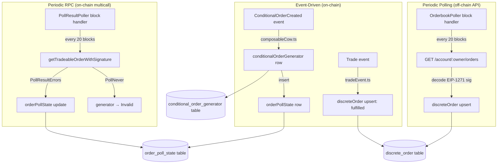
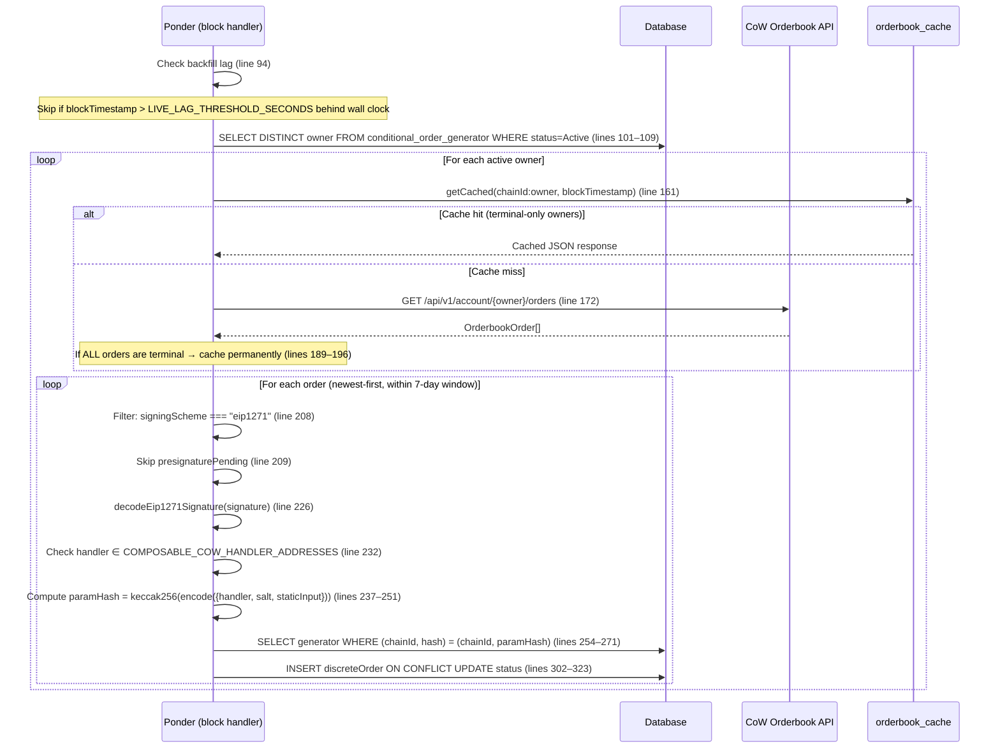
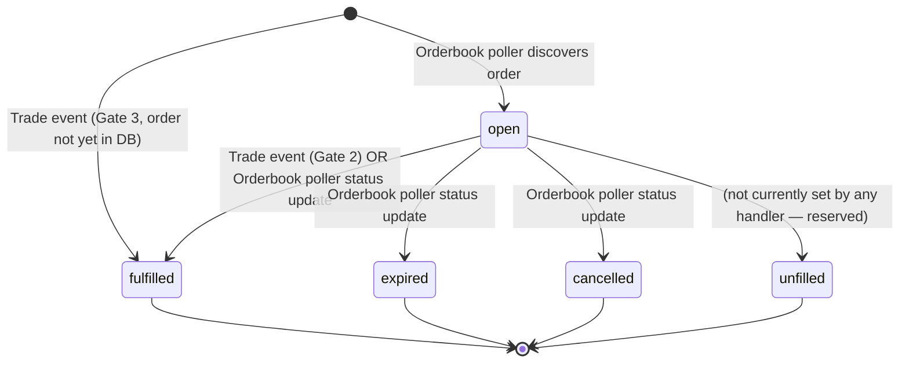

# Current Orderbook Flow — As-Is Documentation

> **Date:** 2026-04-02
> **Status:** Reference document for orderbook cache refactor planning
> **Scope:** Full description of how discrete orders are discovered, linked, cached, and status-tracked

---

## 1. High-Level Architecture

Three independent subsystems discover and update discrete orders:



---

## 2. Generator Creation & Params-Hash Linkage

**File:** `src/application/handlers/composableCow.ts`

When `ConditionalOrderCreated` fires:

1. Extract `{handler, salt, staticInput}` from `event.args.params` (line 17–18)
2. Compute `hash = keccak256(encodeAbiParameters([{handler, salt, staticInput}]))` (lines 19–32)
3. Resolve owner via `ownerMapping` lookup (CoWShed proxy → EOA) (lines 51–63)
4. Insert `conditionalOrderGenerator` with computed `hash` (line 77–111)
5. Insert `orderPollState` with `nextCheckBlock = event.block.number` (lines 114–122)

**The hash is the sole linkage mechanism.** When a discrete order is later found (via API or Trade event), its EIP-1271 signature is decoded to extract `{handler, salt, staticInput}`, the same hash is recomputed, and a DB lookup on `(chainId, hash)` finds the parent generator.

---

## 3. Discrete Order Discovery — Orderbook Poller

**File:** `src/application/handlers/orderbookPoller.ts`

### Trigger

Fires every `ORDERBOOK_POLL_INTERVAL` (20) blocks per chain via Ponder block handlers:
- `OrderbookPollerMainnet:block` (line 60)
- `OrderbookPollerGnosis:block` (line 64)

### Flow



### Key Details

- **Backfill skip:** Compares `Date.now()` to `event.block.timestamp`. If lag exceeds `LIVE_LAG_THRESHOLD_SECONDS` (~720s on mainnet), silently skips. This prevents wasting API calls during historical sync since the Orderbook API only has current state. (`orderbookPoller.ts:92–95`)
- **7-day window:** Orders older than `MAX_ORDER_LIFETIME_SECONDS` (604800s) are skipped via the `cutoffTimestamp` check. Since API returns newest-first, this allows early exit. (`orderbookPoller.ts:98, 206`)
- **TWAP partIndex derivation:** When generator has decoded `t0 > 0` and `t > 0`, computes `partIndex = (validTo - t0) / t - 1`. When `t0 === 0` (most TWAPs), partIndex is left null. (`orderbookPoller.ts:285–292`)
- **Upsert semantics:** Uses Drizzle's `onConflictDoUpdate` on PK `(chainId, orderUid)` — only updates `status`. Other fields (amounts, detectedBy) are immutable after first insert. (`orderbookPoller.ts:317–319`)

---

## 4. Discrete Order Discovery — Trade Event Handler

**File:** `src/application/handlers/tradeEvent.ts`

### Trigger

`GPv2SettlementTrade:Trade` event — fires for every trade on GPv2Settlement. Start block is ComposableCoW genesis (not GPv2Settlement genesis) to limit historical scope.

### Three-Gate Filter

1. **Gate 1 (cheap):** Is `event.args.owner` a known composable cow participant? Checks `conditionalOrderGenerator` and `ownerMapping` tables. Most trades are NOT composable — exit early. (lines 64–88)
2. **Gate 2 (cheap):** Does `discreteOrder` already exist for this `orderUid`? If yes, just update to `fulfilled` + set `filledAtBlock`. (lines 92–120)
3. **Gate 3 (rare):** Order not in DB — fetch from `GET /api/v1/orders/{orderUid}`, decode EIP-1271 signature, find generator, upsert full discrete order row with `status = "fulfilled"`. (lines 123–238)

### Key Details

- **Backfill skip:** Same `LIVE_LAG_THRESHOLD_SECONDS` check as the poller. Historical trades are skipped — the poller covers recent fills when live. (`tradeEvent.ts:53–54`)
- **Most authoritative signal:** Trade events are the definitive fill proof. The `filledAtBlock` field is only set by this handler, never by the poller. (`tradeEvent.ts:107–108`)
- **API fallback:** Gate 3 handles the race where a Trade fires before the poller has seen the order. Fetches the individual order by UID from the API. (`tradeEvent.ts:127–139`)

---

## 5. Order Lifecycle — Block Handler (PollResultErrors)

**File:** `src/application/handlers/blockHandler.ts`

### Trigger

Fires every `ORDERBOOK_POLL_INTERVAL` (20) blocks per chain:
- `PollResultPollerMainnet:block` (line 40)
- `PollResultPollerGnosis:block` (line 44)

### Flow

1. Skip if behind live (same `LIVE_LAG_THRESHOLD_SECONDS` check) (line 72)
2. Query `orderPollState JOIN conditionalOrderGenerator` for due orders: `isActive = true AND nextCheckBlock <= currentBlock` (lines 75–103)
3. Multicall `getTradeableOrderWithSignature` on ComposableCoW for all due orders (lines 112–125)
4. Interpret results per order:

| Result | Action | Next Check |
|--------|--------|------------|
| Success | Order is tradeable | `currentBlock + RECHECK_INTERVAL` (20 blocks) |
| PollTryNextBlock | Transient — not ready yet | `currentBlock + 1` |
| PollTryAtBlock(N) | Schedule for specific block | `max(N, currentBlock + 1)` |
| PollTryAtEpoch(T) | Schedule for estimated block at timestamp T | `estimateBlockForEpoch(T)` |
| PollNever(reason) | Permanently done | `isActive = false`, generator status → `"Invalid"` |
| OrderNotValid | Transient | `currentBlock + 1` |

### Key Details

- **Index-driven query:** Uses `checkBlockActiveIdx` on `(nextCheckBlock, isActive)` for O(1) due-order lookup. This was a lesson from M1 — querying unindexed columns every block kills performance. (`schema/tables.ts:122–123`)
- **No API calls:** This handler only makes RPC multicalls. It does NOT discover discrete orders — it manages generator lifecycle (active → invalid). (`blockHandler.ts:112–125`)
- **Block estimation:** For `PollTryAtEpoch`, estimates target block using chain-specific `BLOCK_TIME_SECONDS`. (`blockHandler.ts:242–253`)

---

## 6. Order Status Transitions



**Who sets each status:**

| Status | Set By | Mechanism |
|--------|--------|-----------|
| `open` | orderbookPoller | API returns `status: "open"` |
| `fulfilled` | tradeEvent (authoritative), orderbookPoller (secondary) | Trade event on-chain / API status |
| `expired` | orderbookPoller | API returns `status: "expired"` |
| `cancelled` | orderbookPoller | API returns `status: "cancelled"` |
| `unfilled` | orderbookPoller | API returns `status: "unfilled"` (rare — CoW-specific) |

**Generator status transitions** (separate from discrete order status):

| Status | Meaning | Set By |
|--------|---------|--------|
| `Active` | Generator is producing orders | Default on creation |
| `Cancelled` | User cancelled the conditional order | (ConditionalOrderCancelled event — not yet implemented in M3) |
| `Invalid` | PollNever received — order is permanently untradeable | blockHandler via PollNever |

---

## 7. Caching Layer

**File:** `src/application/handlers/setup.ts` (DDL), `orderbookPoller.ts` (read/write)

### orderbook_cache Table

Created via raw DDL in the `ComposableCow:setup` handler (not exported from `schema/tables.ts`):

```sql
CREATE TABLE IF NOT EXISTS orderbook_cache (
  cache_key     TEXT PRIMARY KEY,    -- "{chainId}:{owner}"
  response_json TEXT NOT NULL,       -- Full JSON array of OrderbookOrder[]
  fetched_at    BIGINT NOT NULL      -- Block timestamp when fetched
)
```

### Cache Policy

- **Terminal owners only:** An owner is cached only when ALL their orders are in terminal states (`fulfilled`, `expired`, `cancelled`). (`orderbookFetch.ts`)
- **No expiry:** Terminal states cannot change, so cached responses never expire.
- **Open orders never cached:** If any order is `open` or `presignaturePending`, the owner is always re-fetched. (`orderbookFetch.ts`)
- **Cache key:** `{chainId}:{ownerAddress}` (line 158)

### Why Raw DDL?

Ponder drops all `onchainTable` tables on full resync. The cache must survive resyncs to avoid re-fetching terminal orders. Raw DDL via `CREATE TABLE IF NOT EXISTS` persists across `ponder dev` restarts.

**Known issue:** In production (`ponder start`), each deployment gets a fresh schema. The raw DDL table lives in the old schema and is NOT carried over, defeating cache persistence. See `thoughts/tasks/LOCAL-orderbook-cache-persistence-prod.md`.

---

## 8. Backfill Skip Logic

All three handlers use the same guard:

```typescript
const nowSeconds = Math.floor(Date.now() / 1000);
const lagSeconds = nowSeconds - Number(event.block.timestamp);
if (lagSeconds > LIVE_LAG_THRESHOLD_SECONDS) return;
```

**`LIVE_LAG_THRESHOLD_SECONDS`** = `ORDERBOOK_POLL_INTERVAL × max(BLOCK_TIME_SECONDS) × 3` = `20 × 12 × 3` = **720 seconds** (12 minutes). (`src/constants.ts:16–17`)

**Rationale:** The Orderbook API only has current state — fetching during historical sync provides no useful data and wastes API/RPC budget. The 3× multiplier ensures a slightly-behind live indexer is not treated as backfill.

| Handler | Behavior During Backfill |
|---------|-------------------------|
| orderbookPoller | Silently skips (no log, to avoid flooding) |
| tradeEvent | Returns immediately |
| blockHandler | Returns immediately |

**Implication:** After a full resync or first deploy, discrete orders are only populated once the indexer reaches live. Historical discrete orders are never backfilled — only the last 7 days are fetchable from the API anyway (`MAX_ORDER_LIFETIME_SECONDS`).

---

## 9. Ownership Resolution

**Table:** `ownerMapping` (`schema/tables.ts:127–142`)

Maps proxy/helper addresses to their true EOA owner:

| `addressType` | Source | Example |
|---------------|--------|---------|
| `cowshed_proxy` | `COWShedBuilt` event | CoWShed proxy → EOA |
| `flash_loan_helper` | `Settlement` event + ABI inspection | Aave adapter → EOA |

**Resolution flow in composableCow.ts** (lines 51–63):
1. Look up `ownerMapping` for `(chainId, owner)` 
2. If found, use `mappingRows[0].owner` as `resolvedOwner`
3. If not found, `resolvedOwner = owner` (assume direct EOA or Safe)

**Resolution flow in the API** (`src/api/index.ts:42–141`):
1. Given an EOA address, find all proxy addresses via `ownerMapping.owner = EOA`
2. Find all generators owned by EOA OR any proxy
3. Return discrete orders for those generators

**Gap:** Flash loan adapter mappings are created by `settlement.ts` which runs on a later start block. If a `ConditionalOrderCreated` fires before the settlement handler has created the mapping, `resolvedOwner` is set to the adapter address (not the EOA). The comment at `composableCow.ts:50–51` acknowledges this: "For AAVE adapters the mapping won't exist yet; settlement.ts will backfill later." However, there's no mechanism to retroactively update `resolvedOwner` on the generator after the mapping is created.

---

## 10. Schema Summary

| Table | Type | Survives Resync? | Purpose |
|-------|------|------------------|---------|
| `conditional_order_generator` | `onchainTable` | No | Stores indexed generators with params hash |
| `discrete_order` | `onchainTable` | No | Individual orders linked to generators |
| `order_poll_state` | `onchainTable` | No | Block handler scheduling state |
| `owner_mapping` | `onchainTable` | No | Proxy → EOA resolution |
| `transaction` | `onchainTable` | No | Block metadata for generators |
| `orderbook_cache` | Raw DDL | Yes (dev) / No (prod) | Per-owner API response cache |

All `onchainTable` tables are dropped on full resync and rebuilt from event replay. The `orderbook_cache` is the only table designed to persist, but it has a known production bug (see Section 7).
