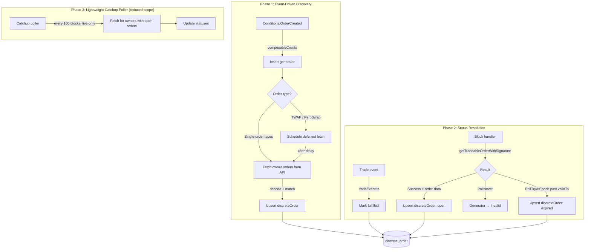
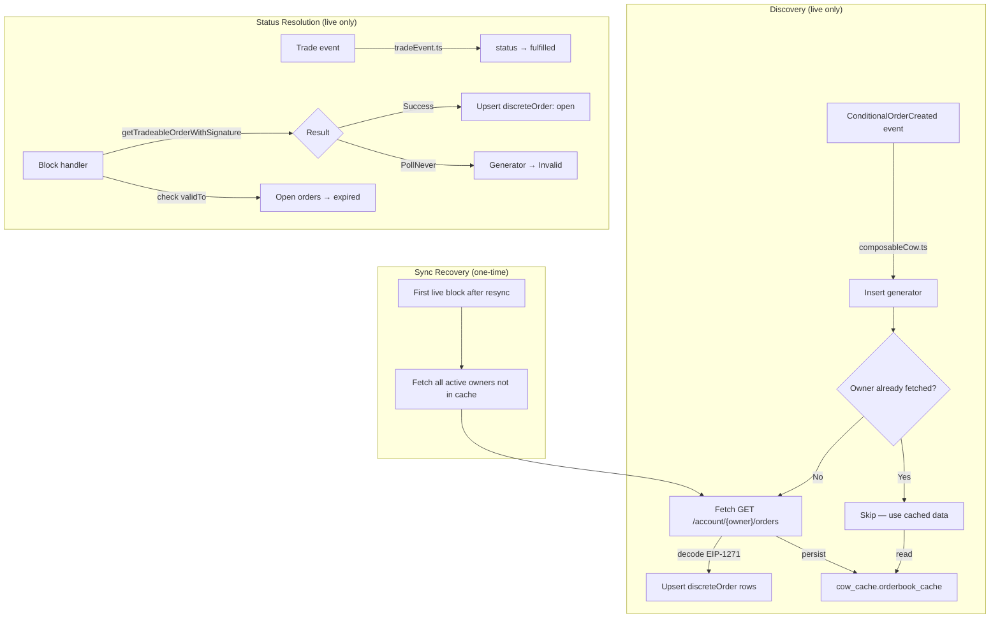

# Orderbook Cache Refactor — Validated Plan

> **Date:** 2026-04-02
> **Status:** Draft plan — pending team review
> **Prerequisite reading:** `thoughts/current-orderbook-flow.md` (as-is documentation)

---

## Part A: Architecture Validation (Task 2)

The team's core hypothesis:

> We don't need to poll the orderbook API during historical sync. Instead, when a conditional order is first indexed, we can fetch all of that owner's orders once and persist them — then derive everything else from that snapshot.

### Assumption 1: Polling during historical sync is unnecessary

**Verdict: VALID — already implemented.**

The current codebase already skips all API and RPC calls during backfill:
- `orderbookPoller.ts:92–95` — skips when `lagSeconds > LIVE_LAG_THRESHOLD_SECONDS`
- `tradeEvent.ts:53–54` — same guard
- `blockHandler.ts:72` — same guard

The Orderbook API only has current state (not historical snapshots), so fetching during backfill would return present-day data mapped to past blocks — producing incorrect results. This is correctly handled.

**For first deploy / full re-index:** The indexer replays all `ConditionalOrderCreated` events, rebuilds `conditionalOrderGenerator` and `orderPollState`, but discrete orders are only populated once live. This means after a full resync, there is a gap: generators exist but their discrete orders are missing until the poller catches up. The current 7-day `MAX_ORDER_LIFETIME_SECONDS` window means orders older than 7 days are permanently lost after a resync. This is a **real data loss scenario** that the refactor should address.

### Assumption 2: A single fetch-on-creation is sufficient

**Verdict: PARTIALLY VALID — with caveats for time-delayed order types.**

For **Stop Loss, Good After Time, Trade Above Threshold** (single-order generators): a fetch-on-creation could work, but there's a **race condition** — the discrete order may not yet exist in the Orderbook API when the `ConditionalOrderCreated` event fires. The watch-tower must first pick up the conditional order, call `getTradeableOrderWithSignature`, and post the resulting order to the API. This takes at minimum one block cycle.

For **TWAP** orders: parts are created over time (e.g., 30 parts over 3 hours). A single fetch at creation time would capture at most the first part. Later parts don't exist yet. **Fetch-on-creation alone is insufficient for TWAP.**

For **Perpetual Swap**: orders are generated indefinitely. Fetch-on-creation captures nothing useful — no discrete orders exist at creation time.

**Evidence:** The TWAP example in `m3-orderbook-api-research.md` shows `n: 30, t: 360` — 30 parts created 6 minutes apart. The watch-tower creates each part only when the previous one's `validTo` passes. A single fetch at the `ConditionalOrderCreated` event would see zero parts (the first part hasn't been posted yet).

### Assumption 3: Ponder won't overwrite/invalidate persisted order data on reorg or re-index

**Verdict: PROBLEMATIC — schema-managed tables are dropped on resync.**

All `onchainTable` tables (including `discreteOrder`) are dropped on full resync (`schema/tables.ts`). Only the `orderbook_cache` (raw DDL) survives — and even that fails in production due to the per-deployment schema issue (`LOCAL-orderbook-cache-persistence-prod.md`).

If discrete orders are stored in `onchainTable` and the indexer resyncs, all discrete order data is lost. The current architecture accepts this by re-fetching from the API once live. But the proposed fetch-on-creation model would NOT re-fetch — creation events have already been replayed, and the "fetch" happened in the old run.

**This is the fundamental tension:** the refactor proposes to make creation-time the fetch point, but creation events are replayed during resync in historical mode (when API calls are skipped). **Needs team clarification:** should discrete order data be moved to a raw DDL table (like `orderbook_cache`) to survive resyncs? This trades Ponder's managed schema benefits for persistence.

### Assumption 4: Trade events + block handler can cover status resolution without polling

**Verdict: VALID for fulfillment, PARTIALLY VALID for expiry.**

- **Fulfillment:** `Trade` events are the authoritative fill signal. Already implemented in `tradeEvent.ts`. No API needed.
- **Cancellation:** Can be detected via `ConditionalOrderCancelled` event (not yet implemented) or via block handler `PollNever`.
- **Expiry:** For TWAP, expiry is computable from decoded params (`validTo` of each part). For other order types, expiry requires knowing the discrete order's `validTo`, which comes from the API response or from `getTradeableOrderWithSignature` return value. The block handler currently detects expiry indirectly via `PollNever` or `OrderNotValid`, but doesn't create a discrete order row for the expired part — it only marks the generator as `Invalid`.

**Gap:** The block handler (`blockHandler.ts`) manages generator lifecycle but does NOT create `discreteOrder` rows. There's no mechanism to record "TWAP part 17 expired unfilled" — only "the generator is now Invalid." To track per-part expiry, either the poller or a new block-handler path must create discrete order rows with `status: "expired"`.

### Assumption 5: Open-status orders are re-evaluated on restart

**Verdict: YES — but only via the poller.**

After restart, the poller re-fetches all active owners and overwrites `discreteOrder.status` via `onConflictDoUpdate` (`orderbookPoller.ts:317–319`). Orders that transitioned from `open` to `fulfilled`/`expired` during downtime are caught.

If the poller is removed, this re-evaluation mechanism disappears. The Trade event handler covers fulfillment but NOT expiry. **Needs team clarification:** what replaces the poller's role in detecting status transitions during indexer downtime?

---

## Part B: M3 Alignment Check (Task 3)

**Reference:** `CLAUDE.md` M3 section, `thoughts/reference_docs/grant_aligned_summary.md`

### M3 Grant Deliverables

| # | Deliverable | Refactor Impact |
|---|-------------|-----------------|
| 1 | Pooling of historical and real-time orderbook data | **Directly affected.** Refactor changes the polling model. Must still deliver equivalent data coverage. |
| 2 | Matching of orderbook orders with their programmatic order generators | **Unaffected.** Params-hash linkage is independent of fetch strategy. |
| 3 | Linking orders to their originating composable cow order | **Unaffected.** Same linkage mechanism. |
| 4 | Tracking execution status for Composable CoW orders | **Directly affected.** Refactor changes how statuses are resolved. Must still track open/fulfilled/expired/cancelled. |
| 5 | Implementation of persistent off-chain cache layer | **Eliminated if refactor succeeds.** If periodic polling is removed, the cache problem goes away. |

### Task-Level Impact

| Task | Status | Refactor Impact |
|------|--------|-----------------|
| COW-737 Orderbook polling | Implemented | **Replaced** by fetch-on-creation + event-driven updates |
| COW-731 ERC1271 decoder | Implemented | **Unaffected** — still needed for signature decoding |
| COW-732 Schema: discreteOrder | Implemented | **May need changes** — if moved to raw DDL for persistence |
| COW-733 Schema: orderPollState | Implemented | **Unaffected** — block handler still needs scheduling state |
| COW-734 Schema: orderbook_cache | Implemented | **Potentially eliminated** — no cache needed without periodic polling |
| COW-736 Trade event handler | Implemented | **Unaffected** — remains the authoritative fill signal |
| COW-738 Block handler | Implemented | **Extended** — needs to handle expiry detection for discrete orders |
| COW-739 GraphQL layer | Implemented | **Unaffected** — queries same tables regardless of data source |

### Alignment Assessment

The refactor **serves M3** by:
1. Solving the production cache persistence problem (`LOCAL-orderbook-cache-persistence-prod.md`) by eliminating the cache entirely
2. Reducing API dependency — less fragile in production (no polling = no API rate limit concerns)
3. Simplifying the architecture — fewer moving parts to maintain

The refactor **risks M3** by:
1. Potentially losing coverage for time-delayed order types (TWAP parts, Perpetual Swap)
2. Introducing a gap between "order created on-chain" and "order discoverable in API"
3. Requiring the block handler to take on more responsibility (expiry tracking)

**Recommendation:** The refactor is within M3 scope (it touches deliverables 1, 4, 5) and is well-motivated by the production cache bug. Proceed, but with the hybrid approach described in Part C below — don't fully eliminate the poller until TWAP/PerpetualSwap coverage is proven.

---

## Part C: Refactor Plan (Task 4)

### Recommended Architecture



### Numbered Steps

#### Step 1: Add fetch-on-creation to composableCow.ts

**What:** After inserting the generator, immediately fetch `GET /account/{owner}/orders` from the Orderbook API.

**Details:**
- Only fetch when live (not during backfill — same `LIVE_LAG_THRESHOLD_SECONDS` guard)
- Decode all EIP-1271 orders, match to generators, upsert discrete orders
- Handle the race condition: if API returns no matching orders (watch-tower hasn't posted yet), schedule a retry via `orderPollState.nextCheckBlock = currentBlock + 5` (or similar small delay)
- Extract the fetch-and-match logic from `orderbookPoller.ts:processOwner` into a shared utility so both paths use the same code

**Risk:** API unavailability at creation time means no discrete orders are discovered. Mitigated by the catchup poller (Step 4).

#### Step 2: Extend block handler to create discrete order rows

**What:** When `getTradeableOrderWithSignature` succeeds, extract the returned order data and upsert a `discreteOrder` row with `status: "open"` and `detectedBy: "block_handler"`.

**Details:**
- The ABI for `getTradeableOrderWithSignature` returns `(GPv2Order.Data memory order, bytes memory signature)` on success — the order data is already available in the multicall result
- Compute the `orderUid` from the returned order data (requires `GPv2Order hash` computation — see cow-sdk for reference)
- For TWAP: derive `partIndex` from `validTo` and decoded params
- When `PollTryAtEpoch` returns a timestamp that is in the past relative to the order's `validTo`, the part has expired unfilled — upsert with `status: "expired"`

**This is the key change** that makes fetch-on-creation viable for TWAP: the block handler discovers each part as it becomes tradeable, without needing the API.

**Complexity:** Computing `orderUid` requires hashing the `GPv2Order.Data` struct with the domain separator. This is ~20 lines of deterministic code but must exactly match the on-chain computation. **Needs investigation:** verify the exact hash computation against `GPv2Settlement.sol`.

#### Step 3: Reduce orderbook poller scope

**What:** Don't eliminate the poller — reduce it to a lightweight "catchup" role.

**Details:**
- Increase interval from 20 blocks to ~100 blocks (~20 min on mainnet)
- Only poll owners who have generators with `status: "Active"` AND at least one `discreteOrder` with `status: "open"` (much smaller set than all active owners)
- Purpose: catch status transitions (open → expired/cancelled) that the block handler and trade event don't cover
- This is the safety net for edge cases: API-only status changes, orders that the block handler doesn't observe

**Deferrable:** This step can be deferred if Step 2 proves sufficient. Keep the full poller disabled behind `DISABLE_ORDERBOOK_POLL=true` as a fallback.

#### Step 4: Resolve the production cache problem

**What:** If the poller is reduced to a lightweight catchup role, the cache may no longer be needed. Evaluate and potentially remove `orderbook_cache`.

**Options:**
- **If poller is eliminated:** Remove `orderbook_cache`, `setup.ts` DDL, and all cache helpers. Simplest path.
- **If catchup poller remains:** The cache problem is less critical (polls are infrequent). Could move to `public` schema via `SET search_path`, or use a fixed schema name in the DDL. **Needs Ponder team input** on whether `context.db.sql.execute` can target a non-deployment schema.

#### Step 5: Handle re-index data recovery

**What:** After a full resync, discrete orders are lost (they're in `onchainTable`). Define the recovery strategy.

**Options:**
- **Accept the gap:** After resync, discrete orders are only populated once live. Historical orders older than 7 days are permanently lost. This is the current behavior and may be acceptable.
- **Fetch on first live block:** When the indexer transitions from backfill to live (first block where `lagSeconds < LIVE_LAG_THRESHOLD_SECONDS`), trigger a full fetch for all active owners. This is a one-time burst of API calls but recovers recent data.
- **Move discreteOrder to raw DDL:** Like `orderbook_cache`, make it persist across resyncs. **Not recommended** — loses Ponder's type-safe schema management and relation support.

**Recommendation:** Option B (fetch on first live block). Add a flag in `orderbook_cache` (or a new raw DDL table) that tracks "has this owner been fetched since last resync?" to avoid redundant fetches.

### Sequencing

```
Step 1 (fetch-on-creation) ──→ Step 2 (block handler discrete orders) ──→ Step 3 (reduce poller)
                                                                              │
                                                                              ↓
                                                                         Step 4 (cache cleanup)
                                                                              │
                                                                              ↓
                                                                         Step 5 (re-index recovery)
```

Steps 1 and 2 can be developed in parallel (different files). Step 3 depends on validating that Steps 1+2 provide sufficient coverage. Steps 4 and 5 are cleanup that can be deferred.

### Schema Changes

**Likely changes:**
- `detectedByEnum`: Add `"block_handler"` value — already present in schema (`schema/tables.ts:38–42`). No change needed.
- `discreteOrder`: May need `validTo` column (currently not stored) if block handler needs to check expiry. Currently `validTo` is only available in the API response or the `getTradeableOrderWithSignature` return value.

**Possible changes:**
- New raw DDL table for "resync fetch state" (Step 5, Option B)
- Remove `orderbook_cache` DDL (Step 4, if poller eliminated)

### Risks

| Risk | Likelihood | Impact | Mitigation |
|------|-----------|--------|------------|
| `orderUid` computation doesn't match on-chain | Medium | High — wrong UIDs mean no match | Verify against cow-sdk and live data before merge |
| Block handler becomes too slow with discrete order upserts | Low | Medium — adds one DB write per multicall result | Already batched; measure before optimizing |
| Race condition: API has no orders at creation time | High for fast order types | Low — catchup poller or retry covers it | Schedule retry in orderPollState |
| TWAP parts missed between block handler checks | Low | Medium — 20-block interval may miss short-lived parts | TWAP parts have `validTo` windows; block handler's `PollTryAtEpoch` scheduling prevents misses |
| Perpetual Swap infinite order generation | Certain | Medium — block handler generates a new discrete order every cycle | This is expected behavior; ensure upsert is idempotent |

### Open Questions — Resolved

1. **`orderUid` computation:** ~~Can we compute `orderUid` from `getTradeableOrderWithSignature` return data without the domain separator?~~ **RESOLVED (2026-04-03).** The multicall does NOT return a UID — it returns `GPv2Order.Data` + `signature`. The UID must be computed as `abi.encodePacked(orderDigest, owner, uint32(validTo))` where `orderDigest` is the EIP-712 typed hash against the GPv2Settlement domain separator (`{name: "Gnosis Protocol", version: "v2", chainId, verifyingContract: GPv2Settlement}`). **Decision: install `@cowprotocol/sdk-order-signing`** which exports `computeOrderUid`, `hashOrder`, and `packOrderUidParams`. Note: the existing `@cowprotocol/cow-sdk` dependency is a dead wrapper — it re-exports from 7 sub-packages but none are installed. `sdk-order-signing` must be added explicitly via `pnpm add @cowprotocol/sdk-order-signing`. This brings `ethers` as a transitive dependency.

2. **`getTradeableOrderWithSignature` return value:** ~~Does the success case return enough data?~~ **RESOLVED (2026-04-03).** Yes. The returned `GPv2Order.Data` struct contains all 12 fields (sellToken, buyToken, receiver, sellAmount, buyAmount, validTo, appData, feeAmount, kind, partiallyFillable, sellTokenBalance, buyTokenBalance). This covers every `discreteOrder` column except `orderUid` (computed via Q1 above). The block handler currently discards this data at `blockHandler.ts:136` — it only schedules a recheck on success. Extending it to read the struct and upsert a `discreteOrder` row is straightforward.

3. **Perpetual Swap discovery:** ~~Needs team clarification.~~ **RESOLVED (2026-04-03).** The block handler already calls `getTradeableOrderWithSignature` for PerpSwap generators every recheck interval (20 blocks). On success it gets the current tradeable order. If Step 2 is implemented (block handler creates `discreteOrder` rows from success results), PerpSwap parts are automatically discovered as they become tradeable. Historical PerpSwap parts are unrecoverable regardless of architecture (the API has a retention window). **Accept that only current/future parts are tracked** — this matches current behavior.

4. **Re-index burst fetch:** ~~How many API calls?~~ **RESOLVED (2026-04-03).** Owner count is expected to be tens to low hundreds on mainnet (Composable CoW is a niche power-user feature). Manageable with a simple throttle: process up to 20 owners per block until caught up. At 20 blocks that's 400 owners in ~4 minutes on mainnet.

5. **CoWShed signature format:** ~~Does the block handler need to decode signatures?~~ **RESOLVED (2026-04-03).** No. The block handler goes in the **forward direction** (generator → order), not reverse (signature → generator). It already has handler/salt/staticInput from the DB, calls `getTradeableOrderWithSignature`, and gets back the order struct. No signature decoding needed. The CoWShed format warning only applies to the poller and trade event handler's EIP-1271 decoding path.

### What Can Be Deferred

| Item | Why Deferrable |
|------|---------------|
| Step 4 (cache cleanup) | Cache is harmless if unused; removing it is pure cleanup |
| Step 5 (re-index recovery) | Current behavior (no historical discrete orders after resync) is acceptable short-term |
| Perpetual Swap coverage | PerpSwap is rare; the existing poller (even at reduced frequency) covers it |
| `orderUid` computation in block handler | Can start with API-only discovery (Step 1) and add block handler discovery (Step 2) later |

---

## Part D: Call Findings (2026-04-03) — Refinements to Plan

> **Source:** Team call notes (`notes/call-m3-orderbook-refactor.md`)
> **Status:** These findings should be incorporated into a revised plan by the implementing agent.

### D1: Eliminate Periodic Polling Entirely

The team confirmed: **no polling is needed**. The architecture should be:

1. **Fetch-on-creation:** When a `ConditionalOrderCreated` event fires (live only), fetch all of that owner's orders from the API once.
2. **Owner-level cache:** Persist the fetched orders. If the same owner creates another conditional order later, **skip the API and use cached data** — all their orders were already fetched.
3. **Status transitions via blockchain only:**
   - **Fulfilled:** `Trade` event handler (already implemented)
   - **Expired:** Block handler checks open orders against `validTo` (only runs on latest blocks)
   - **Cancelled:** `ConditionalOrderCancelled` event or `PollNever` result

**Impact on Plan Part C:**
- Step 3 (reduce poller to catchup) → **Eliminate the poller entirely**
- Step 4 (cache cleanup) → **Keep the cache** — it's essential for the owner-level fetch-once strategy. Rename/repurpose `orderbook_cache` as the persistence layer for fetched owner orders, not a polling cache.
- The `orderbook_cache` table (or a replacement) must survive resyncs (raw DDL, not `onchainTable`).

### D2: TWAP-Specific Optimization (Dominant Order Type)

TWAP is the highest-volume order type. Two-track fetch strategy:

- **TWAP orders:** Can derive `orderUID` from decoded params → fetch by `GET /orders/{uid}` (cheaper, no owner-level fetch needed)
- **Non-TWAP orders:** Fetch by owner `GET /account/{owner}/orders` (general path)

This makes the cache key simpler for TWAP (per-order vs per-owner).

**Caveat:** Deriving `orderUID` for TWAP requires solving Open Question 1 (EIP-712 hash computation). This optimization is blocked until that's resolved.

### D3: TWAP Expiry Is Partially Computable Without RPC

Since TWAP behavior is deterministic, we can derive `validTo` for each part from the decoded params:

| Scenario | Computable offline? | Formula |
|---|---|---|
| `t0 > 0`, `span == 0` | **Yes** | `validTo = t0 + (partIndex + 1) * t - 1` |
| `t0 > 0`, `span > 0` | **Yes** | `validTo = t0 + (partIndex * t) + span - 1` |
| `t0 == 0` (most TWAPs) | **Needs creation block timestamp** | Same formulas, but `t0` = `block.timestamp` from `ConditionalOrderCreated` event |

For `t0 == 0`: the contract reads `cabinet(owner, ctx)` which is set to `block.timestamp` at creation time via `CurrentBlockTimestampFactory`. Since Ponder indexes the creation event, we have this timestamp. **Needs validation** that `event.block.timestamp` always equals the `cabinet` value.

**Bug found:** `orderbookPoller.ts:290` has an off-by-one in the `partIndex` inverse formula. Current: `(validTo - t0) / t - 1n`. Should be: `(validTo + 1n - t0) / t - 1n` (contract sets `validTo = t0 + (part+1)*t - 1`).

### D4: Sync Gap Recovery

Risk: orders created between indexer start and sync completion could be lost. Team discussed two mitigations:

1. **One-time fetch on sync completion:** When indexer transitions from backfill to live (first block where `lagSeconds < LIVE_LAG_THRESHOLD_SECONDS`), trigger a full fetch for all active owners. This is a single burst, not recurring.
2. **Owner→conditional order map:** Track which owners have been fetched. Only re-fetch if a new conditional order appears for a previously-unfetched owner.

### D5: Revised Architecture Summary

```
ConditionalOrderCreated (live) ──→ Fetch owner orders from API (once)
                                        │
                                        ├──→ Cache in DB (survives resync)
                                        └──→ Upsert discreteOrder rows
                                                │
                            ┌───────────────────┤
                            ▼                   ▼
                    Trade event              Block handler (latest only)
                    → status: fulfilled      → check validTo for expiry
                                             → status: expired
                                                │
                                                ▼
                                        ConditionalOrderCancelled / PollNever
                                        → status: cancelled / Invalid
```

### D6: Open Question 1 Remains Critical

Computing `orderUID` locally is now **more important** than before:
- The TWAP optimization (D2) depends on it for per-order API fetches
- The block handler discrete order creation (Plan Step 2) depends on it
- Without it, we fall back to owner-level fetching for everything, which still works but is less efficient

**See dedicated section below for the teammate question on this topic.**

### D7: What Changed vs Original Plan

| Plan Item | Original | After Call |
|---|---|---|
| Step 3 (catchup poller) | Keep reduced poller | **Eliminate entirely** |
| Step 4 (cache cleanup) | Maybe remove cache | **Keep cache — it's core to the strategy** |
| TWAP fetch strategy | Same as other types | **Separate fast path via orderUID** |
| TWAP expiry detection | Needs API or RPC | **Computable from params (when t0 > 0)** |
| Block handler role | Discover discrete orders | **Check expiry of existing open orders** |

---

## Part E: Revised Plan (2026-04-03) — Incorporating Review Feedback

> Supersedes the original Steps 1–5 from Part C. Incorporates Part D call findings and reviewer feedback.

### E1: Final Architecture



### E2: Cache Persistence — Separate Schema

**Decision: Option A — separate PostgreSQL schema (`cow_cache`).**

The `orderbook_cache` table moves from the Ponder-managed schema to `cow_cache.orderbook_cache`. Ponder has no awareness of this schema — it survives all resyncs, restarts, and redeployments.

**Schema creation:** You create the schema manually (or via a one-time migration). `setup.ts` creates the table if it doesn't exist:

```sql
-- setup.ts (on ComposableCow:setup)
CREATE SCHEMA IF NOT EXISTS cow_cache;
CREATE TABLE IF NOT EXISTS cow_cache.orderbook_cache (
  cache_key     TEXT PRIMARY KEY,    -- "{chainId}:{owner}" or "{chainId}:{orderUid}"
  response_json TEXT NOT NULL,       -- Full API response JSON
  fetched_at    BIGINT NOT NULL      -- Unix timestamp
);
```

**Access:** All cache reads/writes use `context.db.sql.execute(sql\`... FROM cow_cache.orderbook_cache ...\`)`. If Ponder's executor doesn't allow cross-schema queries, fallback to a standalone `pg` client in a helper module (~10 lines).

**Test plan:** Before implementing the full refactor, run a quick proof-of-concept:
1. Add `CREATE SCHEMA IF NOT EXISTS cow_cache` to `setup.ts`
2. Try `context.db.sql.execute(sql\`SELECT 1 FROM cow_cache.orderbook_cache\`)` (after creating the table)
3. If it works → proceed. If not → switch to standalone `pg` client.

### E3: Eliminate Periodic Polling (Confirmed)

The orderbook poller (`orderbookPoller.ts`) is fully replaced by:

| Old Poller Role | New Source |
|-----------------|-----------|
| Discover open orders | Fetch-on-creation (Step 1) + block handler success (Step 2) |
| Detect fulfilled | Trade event handler (unchanged) |
| Detect expired | Block handler checks `validTo < block.timestamp` on open orders |
| Detect cancelled | `PollNever` from block handler + future `ConditionalOrderCancelled` event |
| Detect unfilled | Same as expired (functionally identical for our purposes) |

**One accepted gap:** Off-chain cancellation (API-only, no on-chain event) won't be detected. This is rare for EIP-1271 orders and acceptable.

**Schema change needed:** Add `validTo` column to `discreteOrder` table so the block handler can check expiry without an API call:
```typescript
validTo: t.integer(),  // uint32, Unix timestamp — set from API response or getTradeableOrderWithSignature
```

### E4: `orderUid` Computation — Pure viem (No ethers)

The `@cowprotocol/sdk-order-signing` package depends on `ethers`, which would be a new transitive dependency. **Instead, implement `computeOrderUid` directly with viem** — the logic is ~30 lines:

```typescript
import { hashTypedData, encodePacked, type Hex } from "viem";

const GPV2_ORDER_TYPE = {
  Order: [
    { name: "sellToken", type: "address" },
    { name: "buyToken", type: "address" },
    { name: "receiver", type: "address" },
    { name: "sellAmount", type: "uint256" },
    { name: "buyAmount", type: "uint256" },
    { name: "validTo", type: "uint32" },
    { name: "appData", type: "bytes32" },
    { name: "feeAmount", type: "uint256" },
    { name: "kind", type: "string" },
    { name: "partiallyFillable", type: "bool" },
    { name: "sellTokenBalance", type: "string" },
    { name: "buyTokenBalance", type: "string" },
  ],
} as const;

export function computeOrderUid(
  chainId: number,
  order: GPv2OrderData,
  owner: Hex,
): Hex {
  const domain = {
    name: "Gnosis Protocol",
    version: "v2",
    chainId,
    verifyingContract: GPV2_SETTLEMENT_ADDRESS,
  };
  const orderDigest = hashTypedData({ domain, types: GPV2_ORDER_TYPE, primaryType: "Order", message: order });
  return encodePacked(["bytes32", "address", "uint32"], [orderDigest, owner, order.validTo]);
}
```

**Validation:** Must produce the same UID as the API's `uid` field for a known order. Test against the TWAP example in `tmp/m3-research/example-order-erc1271.json`.

### E5: Revised Implementation Steps

#### Step 1: Cache infrastructure (cow_cache schema)

- Create `cow_cache` schema + table (DDL in `setup.ts` or manual)
- Move existing cache helpers to use `cow_cache.orderbook_cache`
- Verify cross-schema access works in Ponder's executor
- If it doesn't: implement standalone `pg` client fallback

#### Step 2: `computeOrderUid` utility

- Implement in `src/application/helpers/orderUid.ts` using pure viem
- Validate against known order UIDs from the API
- This unblocks both the block handler extension and TWAP-specific fetch optimization

#### Step 3: Fetch-on-creation in `composableCow.ts`

- After inserting the generator (live only), fetch `GET /account/{owner}/orders`
- Check cache first (owner-level key `{chainId}:{owner}`)
- Decode EIP-1271 orders, match to generators, upsert discrete orders
- Cache the API response (terminal owners: permanent; active owners: store but re-fetch next time)
- Handle race condition: if no matching orders found, schedule retry via `orderPollState.nextCheckBlock = currentBlock + 5`

#### Step 4: Extend block handler to create discrete orders

- On `getTradeableOrderWithSignature` success: read the returned `GPv2Order.Data`
- Compute `orderUid` using Step 2's utility
- Upsert `discreteOrder` with `status: "open"`, `detectedBy: "block_handler"`, `validTo` from the order
- On expiry detection: check existing open discrete orders where `validTo < block.timestamp`, update to `status: "expired"`

#### Step 5: Remove periodic poller

- Delete `orderbookPoller.ts`
- Remove `OrderbookPollerMainnet` / `OrderbookPollerGnosis` from `ponder.config.ts`
- Remove `DISABLE_ORDERBOOK_POLL` env var handling
- Clean up imports and constants

#### Step 6: Sync recovery (one-time burst on live transition)

- Detect first live block: `lagSeconds < LIVE_LAG_THRESHOLD_SECONDS` after previously being in backfill
- Fetch all active owners not already in cache
- Throttle: 20 owners per block until caught up
- Use a simple flag in `cow_cache` (e.g., `cow_cache.sync_state(key='last_live_block')`) to avoid re-running

### E6: Dependency Order

```
Step 1 (cache infra) ──→ Step 3 (fetch-on-creation)
                    ↘
Step 2 (orderUid)  ──→ Step 4 (block handler) ──→ Step 5 (remove poller) ──→ Step 6 (sync recovery)
```

Steps 1 and 2 are independent and can be developed in parallel.
Step 5 should only land after Steps 3+4 are validated in dev.
Step 6 can be deferred if the team accepts the post-resync data gap temporarily.

### E7: Schema Changes Summary

| Change | Table | Type |
|--------|-------|------|
| Add `validTo` column | `discrete_order` | `onchainTable` modification |
| Move cache to `cow_cache` schema | `orderbook_cache` | Raw DDL migration |
| Add `sync_state` table | `cow_cache.sync_state` | New raw DDL (Step 6 only) |

### E8: Risk Update

The `partIndex` off-by-one bug flagged in D3 should be fixed as a prerequisite (it affects both the current poller and the new block handler path). Current formula at `orderbookPoller.ts:290`: `(validTo - t0) / t - 1n`. Correct: `(validTo + 1n - t0) / t - 1n` (contract sets `validTo = t0 + (part+1)*t - 1`).

---

## Part F: How to Execute This Refactor (Implementation Guide)

> **Audience:** Implementing agent or developer. Follow this step-by-step.
> **Strategy:** Changes land on the existing cascade of M3 PR branches. After each PR is updated, rebase all downstream branches, resolve conflicts, and pause for review before continuing.

### F1: PR Cascade (Current State)

The M3 branches form a strict cascade — each is based on the previous:

```
main
 └─ PR #20  cow-732  (schema: discreteOrder, orderPollState, orderbook_cache)
     └─ PR #21  cow-731  (ERC1271 decoder)
         └─ PR #22  cow-737  (orderbook poller)
             └─ PR #23  cow-736  (trade event handler)
                 └─ PR #24  cow-738  (block handler)
                     └─ PR #25  cow-739  (GraphQL API + perf fixes)
```

### F2: Change-to-Branch Mapping

Each refactor step maps to the branch that owns the relevant code:

| Refactor Step | Branch | PR | What Changes |
|---------------|--------|-----|-------------|
| **0. Prerequisites** | `cow-732` | #20 | Add `validTo` column to `discreteOrder` schema; fix `partIndex` off-by-one formula |
| **1. Cache infra** | `cow-732` | #20 | Move `orderbook_cache` DDL from Ponder-managed to `cow_cache` schema |
| **2. `computeOrderUid` utility** | `cow-731` | #21 | New file `src/application/helpers/orderUid.ts` (pure viem) |
| **3. Fetch-on-creation** | `cow-737` | #22 | Replace periodic poller with fetch-on-creation in `composableCow.ts`; repurpose `orderbookPoller.ts` into a shared utility or delete |
| **4. Block handler: discrete orders** | `cow-738` | #24 | Extend block handler to upsert `discreteOrder` rows on success + check expiry |
| **5. Remove poller** | `cow-737` | #22 | Delete `orderbookPoller.ts`, remove block handler registrations from `ponder.config.ts` |
| **6. Trade handler adjustments** | `cow-736` | #23 | Update to use `cow_cache` schema for API calls; store `validTo` on upsert |
| **7. Sync recovery** | `cow-739` | #25 | One-time burst fetch on live transition (can be deferred) |

### F3: Step-by-Step Execution

Work one PR at a time, bottom-up in the cascade. After each PR is updated, rebase all downstream branches, fix conflicts, and **stop for review**.

---

#### PR #20 — `cow-732` (Schema + Cache Infra)

**Prerequisite changes — do these first.**

1. **Add `validTo` column to `discreteOrder`** in `schema/tables.ts`:
   ```typescript
   validTo: t.integer(),  // uint32 Unix timestamp — from API response or getTradeableOrderWithSignature
   ```

2. **Fix `partIndex` off-by-one** everywhere it appears (currently `orderbookPoller.ts:290` and `tradeEvent.ts:206`):
   - Old: `partIndex = (validTo - t0) / t - 1n`
   - New: `partIndex = (validTo + 1n - t0) / t - 1n`

3. **Move `orderbook_cache` to `cow_cache` schema** in `setup.ts`:
   ```sql
   CREATE SCHEMA IF NOT EXISTS cow_cache;
   CREATE TABLE IF NOT EXISTS cow_cache.orderbook_cache (
     cache_key     TEXT PRIMARY KEY,
     response_json TEXT NOT NULL,
     fetched_at    BIGINT NOT NULL
   );
   ```
   - **Test cross-schema access first:** Add a test query in `setup.ts` after creating the table. If `context.db.sql.execute` can't do cross-schema, create a standalone `pg` client helper instead.

4. **Run `pnpm codegen && pnpm typecheck`** to verify schema changes compile.

**Review checkpoint:** Confirm schema changes, cache DDL, cross-schema access works. Then rebase downstream branches:
```bash
git checkout jefferson/cow-731-* && git rebase jefferson/cow-732-*
git checkout jefferson/cow-737-* && git rebase jefferson/cow-731-*
git checkout jefferson/cow-736-* && git rebase jefferson/cow-737-*
git checkout jefferson/cow-738-* && git rebase jefferson/cow-736-*
git checkout jefferson/cow-739-* && git rebase jefferson/cow-738-*
```
Resolve conflicts at each step (mostly in `schema/tables.ts` and `setup.ts`).

---

#### PR #21 — `cow-731` (Decoder + `computeOrderUid`)

1. **Create `src/application/helpers/orderUid.ts`:**
   - Implement `computeOrderUid(chainId, order, owner)` using viem's `hashTypedData` + `encodePacked`
   - Domain: `{ name: "Gnosis Protocol", version: "v2", chainId, verifyingContract: GPV2_SETTLEMENT_ADDRESS }`
   - Types: 12-field `Order` struct matching GPv2Order.sol exactly
   - UID = `encodePacked(["bytes32", "address", "uint32"], [orderDigest, owner, validTo])`
   - Reference: `tmp/contracts/gpv2-contracts/src/ts/order.ts` for field names and normalization
   - **Important:** The `kind` field is `"sell"` or `"buy"` (string, not bytes32). The `sellTokenBalance` / `buyTokenBalance` fields are `"erc20"`, `"external"`, `"internal"` (strings). viem's `hashTypedData` handles string→bytes32 hashing per EIP-712.

2. **Validate:** Compute UID for the known TWAP order in `tmp/m3-research/example-order-erc1271.json` and compare against the API's `uid` field. Must match exactly.

3. **No changes to existing decoder** (`erc1271Signature.ts`) — it's correct as-is.

**Review checkpoint:** Confirm `computeOrderUid` produces correct UIDs. Then rebase downstream.

---

#### PR #22 — `cow-737` (Replace Poller with Fetch-on-Creation)

This is the largest change — the poller is replaced.

1. **Extract shared fetch-and-match logic** from `orderbookPoller.ts` into a reusable utility (e.g., `src/application/helpers/orderbookFetch.ts`):
   - `fetchOwnerOrders(context, chainId, apiBaseUrl, owner)` → fetches from API or cache
   - `matchAndUpsertOrders(context, chainId, orders)` → decodes signatures, matches generators, upserts discrete orders
   - Both the fetch-on-creation path and the trade handler's Gate 3 can reuse this

2. **Add fetch-on-creation to `composableCow.ts`:**
   - After the generator insert (line 111), if live (not backfill), call `fetchOwnerOrders` + `matchAndUpsertOrders`
   - Check `cow_cache.orderbook_cache` for existing cached response first
   - On cache miss: fetch from API, persist to cache
   - Handle race condition: if no matching orders found, no-op (the block handler will discover the order when the watch-tower posts it)

3. **Update cache reads/writes** to use `cow_cache.orderbook_cache` (the new schema from PR #20)

4. **Delete the periodic poller:**
   - Delete `src/application/handlers/orderbookPoller.ts`
   - Remove `OrderbookPollerMainnet` and `OrderbookPollerGnosis` from `ponder.config.ts`
   - Remove `DISABLE_ORDERBOOK_POLL` env var check
   - Clean up any now-unused imports in `src/constants.ts`

5. **Add code comment documenting the API cancellation edge case** at the top of `composableCow.ts` or in the shared fetch utility:
   ```typescript
   // KNOWN LIMITATION: Off-chain cancellation (API-only, no on-chain event) is not
   // detected after the initial fetch. This affects orders cancelled via the CoW
   // Orderbook API's DELETE endpoint without a corresponding on-chain
   // ConditionalOrderCancelled event. This is rare for EIP-1271 composable orders
   // (the standard path is on-chain cancellation via ComposableCoW).
   // See: thoughts/plan-orderbook-cache-refactor.md § E3
   // TODO: If this becomes a real problem, add a lightweight periodic check for
   // owners with open orders. Track in Linear if needed.
   ```

6. **Store `validTo`** on all discrete order upserts (from the API response's `validTo` field).

**Review checkpoint:** Verify the poller is gone, fetch-on-creation works, cache is used. Run `pnpm typecheck`. Then rebase downstream.

---

#### PR #23 — `cow-736` (Trade Event Handler Adjustments)

1. **Update Gate 3 API fetch** to use the shared `fetchOwnerOrders` utility (or keep the single-order fetch `GET /orders/{uid}` — it's simpler for this path)

2. **Store `validTo`** on the discrete order upsert (both Gate 2 update and Gate 3 insert)

3. **Update cache interaction** if Gate 3 writes to `cow_cache.orderbook_cache`

4. Minor: resolve any rebase conflicts from the poller removal.

**Review checkpoint:** Trade handler works with new schema. Then rebase downstream.

---

#### PR #24 — `cow-738` (Block Handler: Discrete Order Creation + Expiry)

This is the second-largest change.

1. **On success result:** Read the returned `GPv2Order.Data` struct from the multicall result. Currently discarded at `blockHandler.ts:136`.
   - Extract: `sellAmount`, `buyAmount`, `feeAmount`, `validTo`, `sellToken`, `buyToken`, `receiver`, `kind`, `appData`
   - Compute `orderUid` using the helper from PR #21
   - Upsert `discreteOrder` with `status: "open"`, `detectedBy: "block_handler"`, `validTo`
   - Derive `partIndex` for TWAP using the corrected formula

2. **Add expiry check:** After processing multicall results, query open discrete orders for this chain where `validTo < block.timestamp`:
   ```sql
   UPDATE discrete_order SET status = 'expired'
   WHERE chain_id = ? AND status = 'open' AND valid_to < ?
   ```
   - This runs only on live blocks (backfill skip already in place)
   - **Performance note:** Add an index on `(chain_id, status, valid_to)` if the query is slow. For now, the existing `statusIdx` should suffice since `open` is a small subset.

3. **On `PollNever`:** Keep current behavior (deactivate poll state, mark generator `Invalid`). Additionally, if there are open discrete orders for this generator, mark them `expired` or `cancelled` depending on the `PollNever` reason.

**Review checkpoint:** Block handler creates discrete orders and detects expiry. Verify with `pnpm dev` against live data. Then rebase downstream.

---

#### PR #25 — `cow-739` (GraphQL + Sync Recovery)

1. **GraphQL layer:** Should need minimal changes — it queries `discreteOrder` and `conditionalOrderGenerator` which have the same shape (just a new `validTo` column).

2. **Sync recovery (deferrable):** If implementing now:
   - Detect first live block in a setup handler or block handler
   - Fetch all active owners not in `cow_cache.orderbook_cache`
   - Throttle: process 20 owners per block
   - Track "sync complete" flag in `cow_cache.sync_state`

3. **Performance fixes** already on this branch (backfill skip, interval tuning) should be reviewed for compatibility with the new architecture.

**Review checkpoint:** Final validation — full flow works end-to-end.

---

### F4: Rebase Cheat Sheet

After updating any branch, rebase all downstream branches in order:

```bash
# From the branch you just updated, rebase each child:
BRANCHES=(
  "jefferson/cow-732-schema-fill-in-discreteorder-table"
  "jefferson/cow-731-add-erc1271-signature-decoder-for-m3-order-matching"
  "jefferson/cow-737-orderbook-polling-discover-open-and-expired-discrete-orders"
  "jefferson/cow-736-trade-event-handler-discrete-order-matching-and-status"
  "jefferson/cow-738-block-handler-unfilledexpired-detection-via-pollresulterrors"
  "jefferson/cow-739-graphql-api-expose-discrete-order-status-and-execution"
)

for i in $(seq 1 $((${#BRANCHES[@]}-1))); do
  echo "Rebasing ${BRANCHES[$i]} onto ${BRANCHES[$((i-1))]}"
  git checkout "${BRANCHES[$i]}"
  git rebase "${BRANCHES[$((i-1))]}"
  # Resolve conflicts if any, then: git rebase --continue
done
```

**Common conflict zones:**
- `schema/tables.ts` — `discreteOrder` definition (added `validTo`)
- `setup.ts` — cache DDL (moved to `cow_cache` schema)
- `ponder.config.ts` — poller block handler registrations (removed)
- `src/constants.ts` — removed poller-specific constants

### F5: Definition of Done (Per PR)

Before marking a PR as ready for review:

- [ ] `pnpm codegen` passes (if schema/config changed)
- [ ] `pnpm typecheck` passes
- [ ] `pnpm lint` passes
- [ ] All downstream branches rebase cleanly (or conflicts are resolved)
- [ ] The API cancellation edge case is documented in code (see PR #22, item 5)
- [ ] No `TODO` items left unaddressed (or explicitly deferred with Linear ticket reference)

### F6: What Can Be Skipped or Deferred

| Item | Deferrable? | Condition |
|------|------------|-----------|
| Sync recovery (Step 7 / PR #25) | Yes | Accept post-resync data gap until needed |
| TWAP-specific orderUID fetch optimization (D2) | Yes | Owner-level fetch works for all types; optimization is performance-only |
| `ConditionalOrderCancelled` event handler | Yes | Not yet implemented; cancellation is covered by `PollNever` |
| Expiry index on `discreteOrder` | Yes | Only add if expiry check query is measurably slow |
